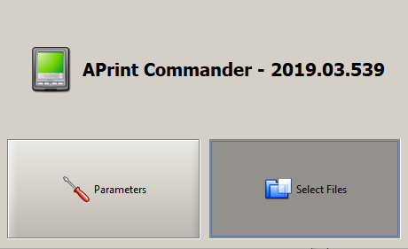
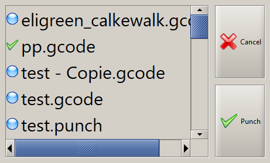
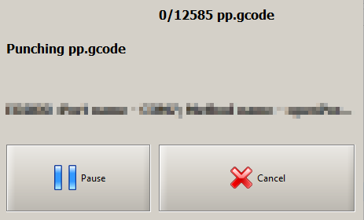
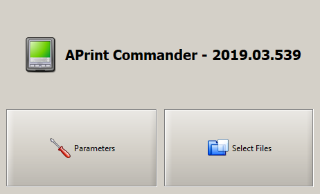
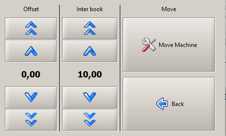
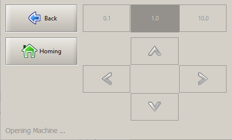

# APrint Commander

Patrice Freydiere - Mai 2019

APrint commander est un petit boitier permettant de piloter une machine CNC , pour perforer sans PC. Ce petit boitier permet de se passer d'un PC dans l'atelier et perforer à partir d'une clef USB.

[Installation du boitier APrintCommander](installation.md)

## Utilisation

Mettre sur une clef USB contenant les fichier à perforer. Deux types de fichiers sont acceptés : les fichier .gcode ou .punch

Les fichiers .GCODE contiennent les ordre CNC pilotant la machine.

Les fichier .Punch contiennent la description des perforations, ainsi que le carton virtuel. (ce format est indépendant )

## Pour perforer un carton :

Dans l'écran principal, appuyez sur le bouton "Select Files"

La liste des fichiers est présentée à l'utilisateur

il est possible de sélectionner les fichiers à perçer, puis la sélection de "punch débute le perçage"

## Effectuer des réglages sur la machine

Dans l'écran principal, certains réglages ont étés rendu accessibles en utilisant l'option "paramètres".

Le tableau de paramètres propose :

- le réglage du décalage de l'origine du carton/machine
- le paramètre de distance entre chaque carton perforés
- un pilotage de la machine, dans les deux axes

L'option Move Machine permet de pouvoir effectuer un homing et des déplacements machine

