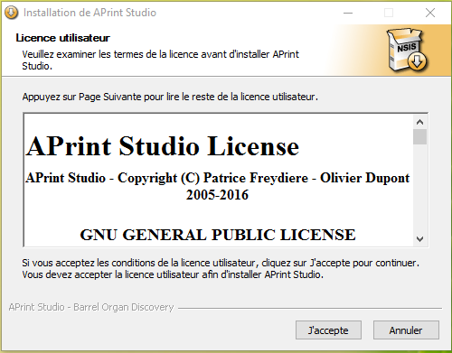
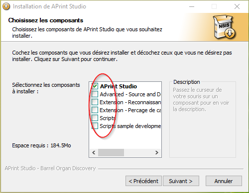
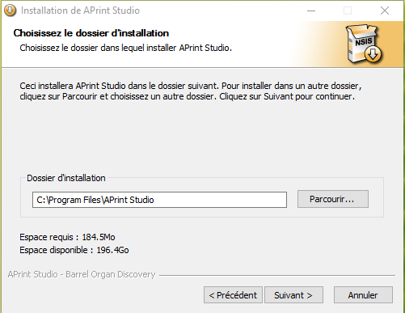
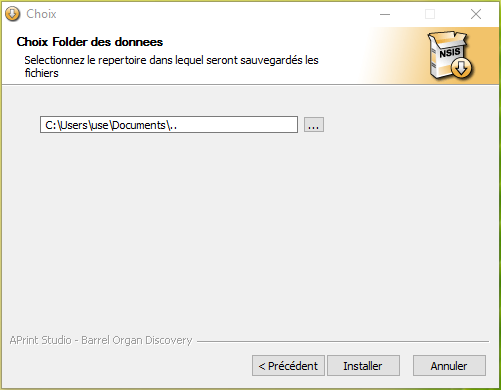
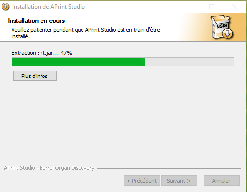
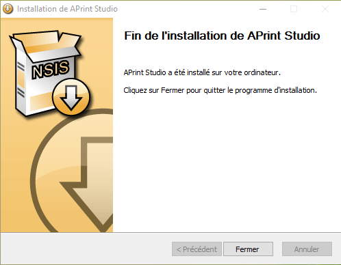
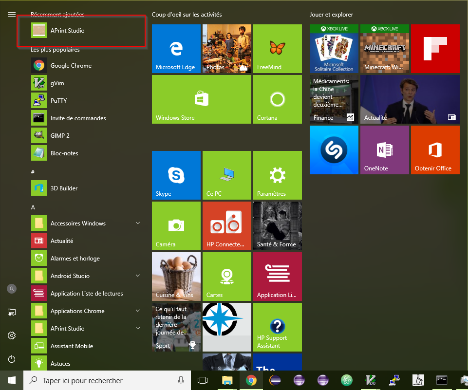

# Etapes d'installation


## Installation sous windows

L'installation est rendue simple sous windows grace à l'installeur. 7 étapes rapides sont proposées pour l'installation.





Choix des composants additionels (extensions + documentation ..)








**Nouveau en version 2017**,  choix du répertoire contenant les fichiers instruments, scripts. Le choix par défaut est le choix habituel de vos fichiers existants. (dans le cas d'une mise à jour). Vous pouvez consulter la rubrique avancée pour plus de détails.




L'installation est en cours.



L'installation est terminée



Le logiciel est maintenant accessible du menu démarré.




## Installation et utilisation sous MacOS

Sous Mac OS,  le fichier **aprint.jar** est fournit, il contient le programme, et peut être lancé directement par "double click". Depuis la version 2016, **Java 8** est nécessaire, dans le cas où le programme ne démarre pas, veuillez vérifier votre version de java installé.

L'utilisation des extensions de perforation ou reconnaissance de cartons, doit être installé dans une 2 eme étape. Le fichiers .extensions associés sont fournis également. Pour les mettre en place, placez ces fichiers à la racine du répertoire de l'utilisateur /home/[utilisateur]/aprintstudio

Lors du prochain lancement du logiciel, les extensions seront prise en compte et apparaitront dans les menus respectifs.


## En cas de problemes

En cas de problèmes, vous pouvez résoudre ceux ci en lançant une ligne de commande java en spécifiant les paramètres manuellement. Les erreurs graves apparaitrons dans la console et vous donneront des informations sur l'origine du problème (manque de mémoire, erreur de lecture .. etc ..)

Lancez la ligne suivante sur une seule ligne :

```
java -Xmx3go -cp aprint.jar org.barrelorgandiscovery.gui.aprintng.APrintApplicationBootStrap
```


Vous pouvez trouver à cette url des informations complémentaires sur l'utilisation java / maxosx :  [https://www.java.com/fr/download/faq/java_mac.xml](https://www.java.com/fr/download/faq/java_mac.xml)