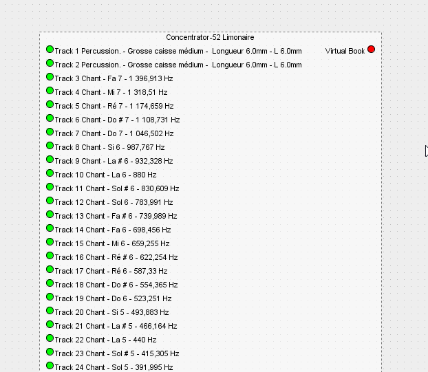
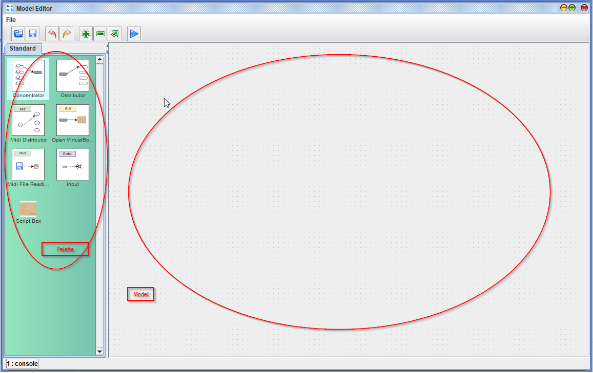
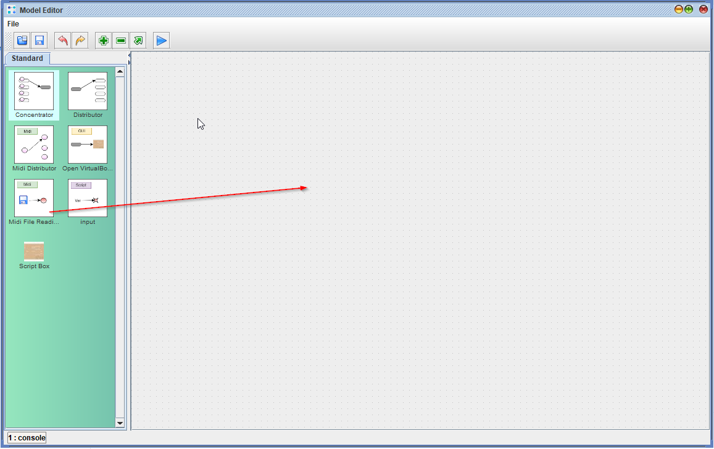
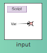
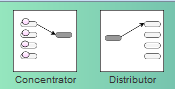
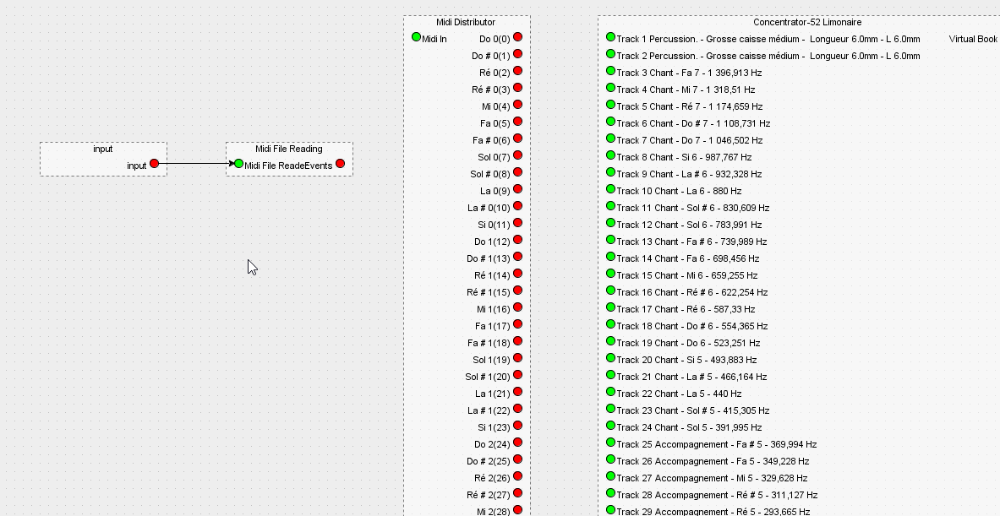
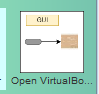
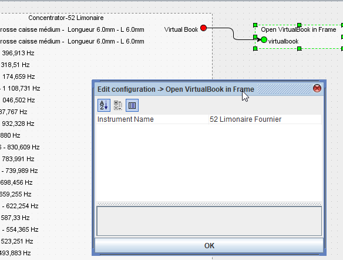
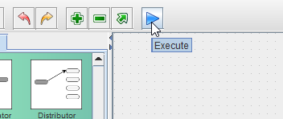
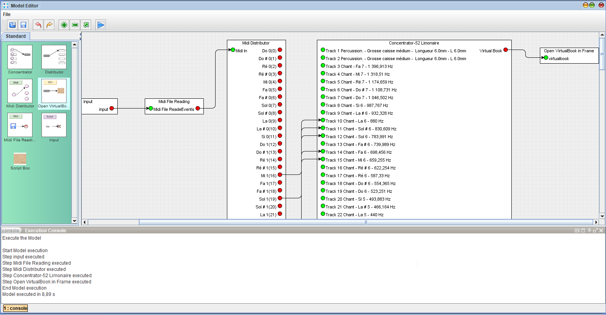

# Introduction au model editor

*Patrice Freydiere - Juin 2018*

Le model editor vous permet d'effectuer des traitements sur les cartons ou les fichiers midi. Il rends plus simple l'import d'un fichier midi particuier, ou propose une façon visuelle d'effectuer des traitements sur les cartons (par exemple, changer le carton de gamme).

## Comprendre le modèle editor

Le modèle editor repose sur des processeurs, proposant des traitements. Chaque processeur effectue un traitement.

Les processeurs prennent en entrée des paramètres, et fournissent des sorties. Dans l'exemple ci dessus, le processeur prends en entrée un fichier midi et fournit des listes de notes, classées par code midi.

## Configuration des processeurs

Les boites de traitements (processeurs), sont configurables. L'accès à la configuration du processeur est réalisable par un double click souris. Ce paramétrage permet de spécifier la gamme de l'instrument, ou d'autres paramètres pouvant faire varier les entrées et les sorties.

Ci dessous un exemple de processeur permettant de transformer une succession de notes ou de trous, en un carton d'orgue de barbarie.

Lorsque configuré le processeur affiche les notes de la gamme, pour permettre des connexions en entrée.

# Le premier modèle

Nous allons voir dans cette section, comment réaliser un premier modèle. Dans ce premier modèle nous allons montrer comment il est possible de lire un fichier midi, puis le convertir en carton d'orgue.

Contrairement à un logiciel d'édition MIDI, l'opération sera répétable à volonté. Plusieurs modèles peuvent être mis en place en fonction des types de fichiers midi d'entrée.

Ci dessous la présentation de le fenetre principale du model editor.

L'écran propose sur la gauche une palette de processeurs et sur la droite la construction du modèle.

## Ajouter un processeur dans l'espace de travail

La première étape consiste à prendre l'élément "Midi File Reading" et le faire glisser sur la zone du modèle.

une fois dans la zone, le processeur propose ses entrées par défaut, il est possible d'observer les paramètres de configuration en double clickant sur le processeur.

## Configuration du processeur

un double click sur le processeur affiche une fenetre de configuration, contenant les paramètres. 

Dans le cas présent, ce processeur prends en entrée un **fichier midi** et propose en sortie **une liste d'évènements MIDI** (les notes + d'autres informations).

pour alimenter l'entrée en fichier midi, on utiliser le processeur input.

Ce processeur permet de paramétrer le modèle en spécifiant des paramètres d'entrée ou de sortie. Lorsqu'il est placé dans le modèle, ce processeur propose un type "chaine de caractère" dans sa configuation.  Le changement du type de parmètre en "fichier" permettra de pouvoir sélectionner un fichier, puis de pouvoir connecter les deux éléments.

## Connexion des deux processeurs

La connexion des deux boites est réalisée en glissé déposé depuis la sortie, comme ci dessous :

Les évènements Midi sont alors disponibles pour permettre la conversion en Carton.

La transformation en carton est réalisée en utilisant le processeur "Concentrator", celui ci accepte en entrée **des évènements de notes midi**, ou des **notes de carton**. En sortie le processeur construit un objet  carton, associé à une gamme d'instrument.

Une fois disposé dans le modèle, il est possible par configuration de choisir la gamme de l'instrument, ce qui fait apparaitre l'ensemble des entrées.

Ci dessous la liste des entrées qui apparaissent lorsque la configuration du processeur est définie.

## Effectuer le mapping des notes

Encore faut il envoyer les bonnes notes Midi sur la bonne piste, une boite va alors nous intéresser : le Midi Distributor. Cette boite permet de répartir les notes midi et nous permet de connecter les notes midi sur le carton.

On connecte alors, La sortie du midi à l'entrée du "Midi Distributor". Puis on peut connecter les pistes midi aux pistes du carton.

Pour afficher le résultat, un processeur est ensuite ajouté pour permettre l'affichage du resultat, dans une fenetre de type "carton" dans APrint Studio.

Un seul paramètre est nécessaire : le nom de l'instrument (que l'on indique comme précédemment dans la configuration, accessible par double click).

Le modèle est terminé, et il est possible de l'executer.

La console en bas à gauche permet de suivre l'execution et informe sur les possibles erreurs.

Le résultat de la lecture s'affiche dans une nouvelle fenetre.

## Synthèse

Voici comment en quelques click , il est possible de faire une lecture personnalisée d'un fichier midi, pour le convertir correctement en carton. Cette conversion est répètable, et peut être utilisée pour plusieurs fichiers midi différents.

# Description des processeurs

| No   | Processeur            | Description                                                  | Configuration associée                                       |
| ---- | --------------------- | ------------------------------------------------------------ | ------------------------------------------------------------ |
| 1    | **Concentrator**      | Fusionne des évènements midi ou des notes d'un carton        | Gamme utilisée                                               |
| 2    | **Distributeur**      | Réparti les notes d'un CARTON                                | Gamme utilisée pour les sorties                              |
| 3    | **Midi Distributor**  | Réparti les évènements, par leur midi code                   | Possibilité de limiter les sorties à une plage de MidiCode, ou filtrer le canal des notes |
| 4    | **Open Virtual Book** | Affiche un carton dans une nouvelle fenetre                  | Le nom de l'instrument                                       |
| 5    | **Read Midi File**    | Lecture d'un fichier midi et extraction des évènements       | -                                                            |
| 6    | **Input**             | Processeur générique, permettant de définir une valeur nécessaire pour un processeur | Type de paramètre (entrée / sortie) Type de paramètre (fichier, boolean, chaine de caractères, ... ) |
| 7    | **Script**            | Processeur "Script", permettant de créer de nouveau processeur pour des taches plus complexes | Le script définissant le processeur.                         |

