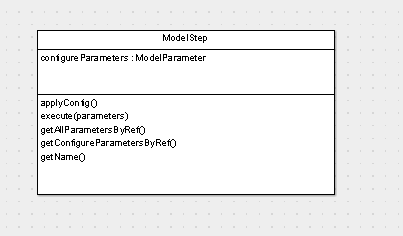
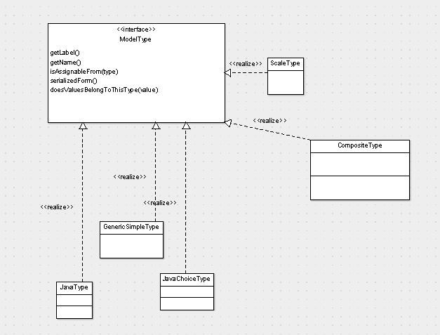

# Implementation processeur

*Patrice Freydiere - Février 2019*

Dans le modèle objet, les étapes sont implémentées par la classe **ModelStep**. Cette classe de base définit les règles associées au fonctionnement du traitement. Ci dessous les propriétés et méthodes importantes de la classe



Cette classe est utilisée en dérivation dans toutes les implémentations d'étape du logiciel (Scripting, sur base objet, Visuel ... )


Chaque implémentation d'étape de modèle (processeur) prend en charge :

- Des paramètres de configuration (ces paramètres de configuration peuvent modifier les entrée et les sorties) **getConfigureParametersByRef()**
- Une description des paramètres d'entrée et de sortie (**getAllParametersByRef**)
- L'execution de l'étape (implémentation de la méthode **execute**).


## Cycle de vie des processeurs

#### Configuration

Le processeur est instancié, puis propose des paramètres de configuration. Ces paramètres sont définis dans le modèle en utilisant un "double click", et propose la configuration du processeur. La validation de la configuration conduit le modèle editor à appeler la fonction **applyConfig** du processeur pour éventuellement modifier la liste des paramètres. 


#### **Execution**

Lorsque la configuration est terminée dans le modèle ainsi que les entrée nécessaires configurées, un graph des étape est créé pour permettre l'ordonnancement des étapes. L'éxécuteur principal réalise ensuite une éxécution ordonnée des méthodes 'execute' des différents **ModelStep**. 


## Typage des paramètres

Le model editor a son propre système de typage pour permettre la définition d'équivalence de type et simplifier l'utilisation. En effet,  il est parfois nécessaire de pouvoir présenter des objets avec de multiples facettes, et notamment pour la gestion des évènements, qui peuvent être : des évènements midi ou des trous dans les cartons. Le système de typage permet alors de pouvoir donner des équivalences de typage en fonction de l'usage réalisé.




Les règles de connexion entre les boites du modèle éditor vérifie alors l'equivalence de type proposé. (Dans le cas contraire, les connexions ne sont pas possibles)

Les deux procedures principales pour le typage sont :

- isAssignableFrom : permet de tester si un type "correspond à un autre", (inclusion)
- doesValueBelongToThisType: permet de savoir si une instance correspond au type


Les différentes implémentation du modèle de type sont :


GenericSimpleType: correspondance des collections java (il est possible d'utiliser des interfaces, pour la définition des contraintes sur l'élément).

CompositeType: choix entre plusieurs types 

exemple de choix entre une liste de \<HoleWithScale\> ou VirtualBook

```
inVirtualBook.setType(new CompositeType(
				new ModelType[] { new GenericSimpleType(Collection.class, new Class[] { HoleWithScale.class }),
						new JavaType(VirtualBook.class) },
```

Javatype : exposition d'un type java

JavaChoiceType: choix entre plusieurs types simple java


