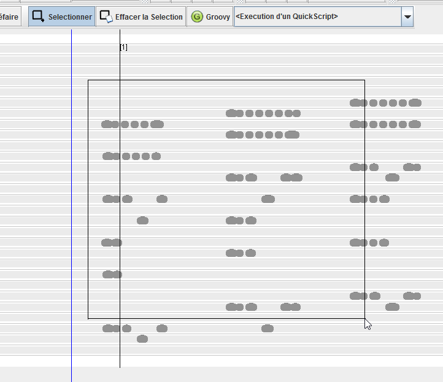
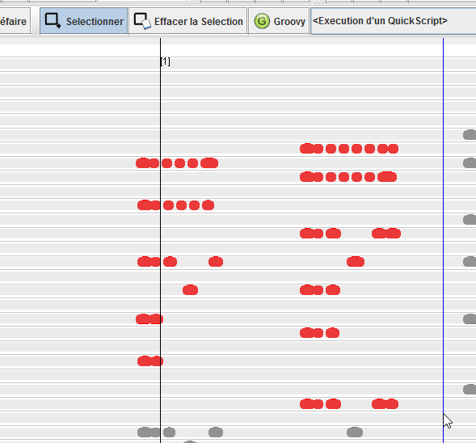

# Utiliser la sélection

La barre d'outil d'édition comprend deux outils permettant de sélectionner des trous sur le carton. Cette sélection permet de supprimer un ensemble de trous (en utilisant la touche "Suppr") ou utiliser les trous dans un script.

## Sélectionner

Pour sélectionner un ensemble de trous, utiliser l'outil de sélection.

## Modifier une sélection

En utilisant les touches "Majuscule" et "Control" du clavier lors de l'action de sélection, il est possible d'unitairement modifier la sélection en ajoutant des trous.

## Agir avec la sélection

Les notes sélectionnées peuvent être supprimées en utilisant la touche Suppr. D'autres modifications sont possibles via des scripts "quickscripts", référez vous à la section d'aide correspondante.

 
