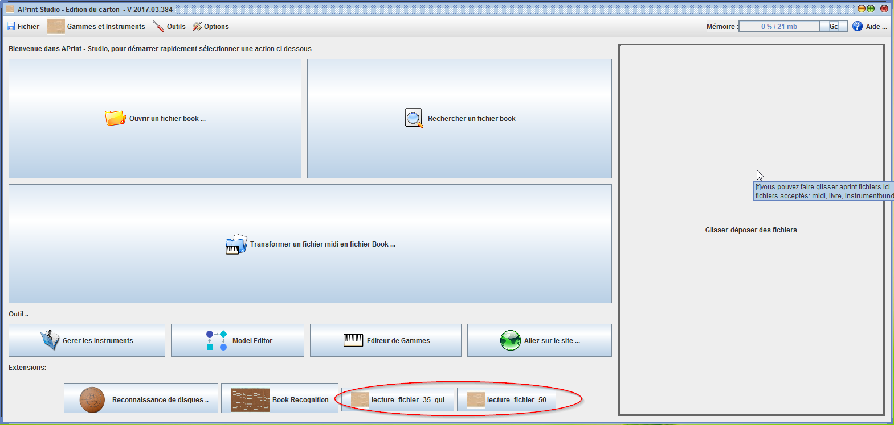
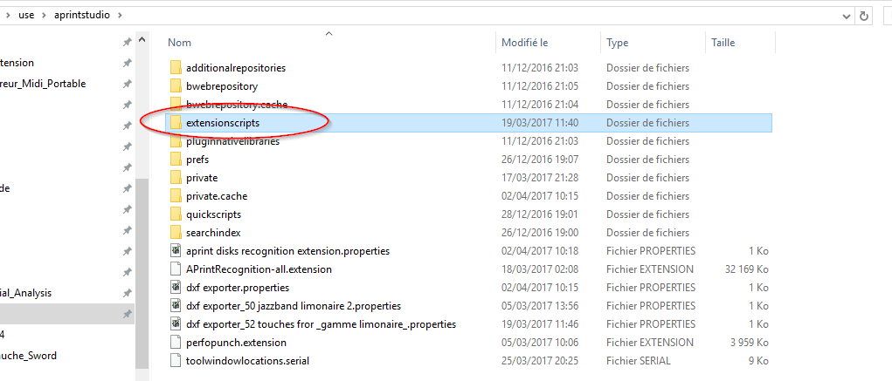

# Creation d'extensions avec groovy

Il est possible depuis la version 2017, de proposer une extension dans la fenêtre principale d'APrint Studio. Cette possibilité simplifie la mise en oeuvre pour les utilisateurs finaux, qui n'ont pas besoin de comprendre le fonctionnement des scripts.

Une simple pression sur le bouton, lance la fonctionnalité demandée.

Exemple de présentation des scripts principaux :

## Préparation du script

Le script écrit est un script général, comme expliqué dans la section suivante : [Introduction aux scripts](mdwiki.html!scripting/scripting.md).

Le script, "aprintgroovyscript" une fois créé avec la console générale, peut être installé pour être présenté dans la fenêtre principale.

## Installation de l'extension

Le script définissant l'extension est placé dans le répertoire de contenu d'aprint studio, dans un sous répertoire nommé extensionscripts comme dans l'illustration ci dessous : 

Lors du démarrage du logicel, le répertoire est scanné pour en extraire la liste des scripts ".aprintgroovyscript", et ajouté sous forme de bouton dans l'interface.

Un icon peut être associé en créant un fichier .png à coté et portant le même nom que le script.