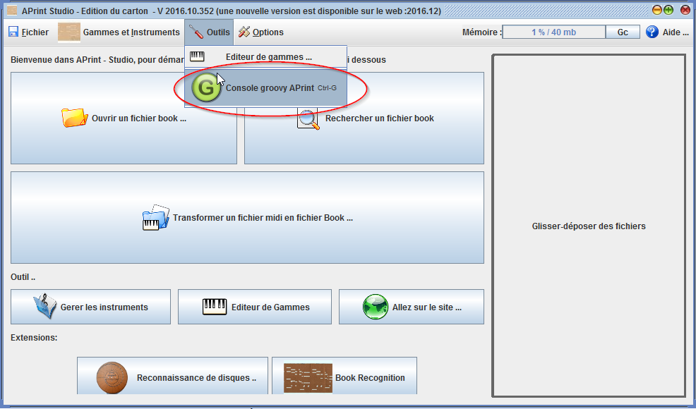
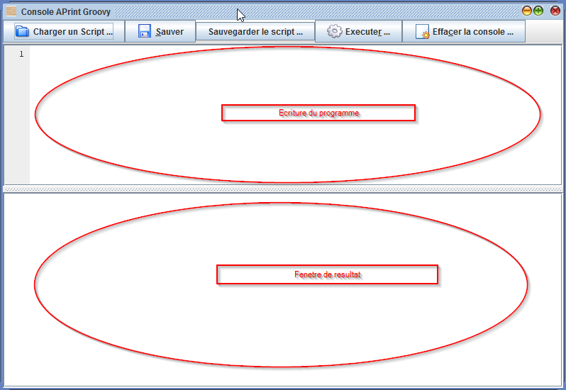
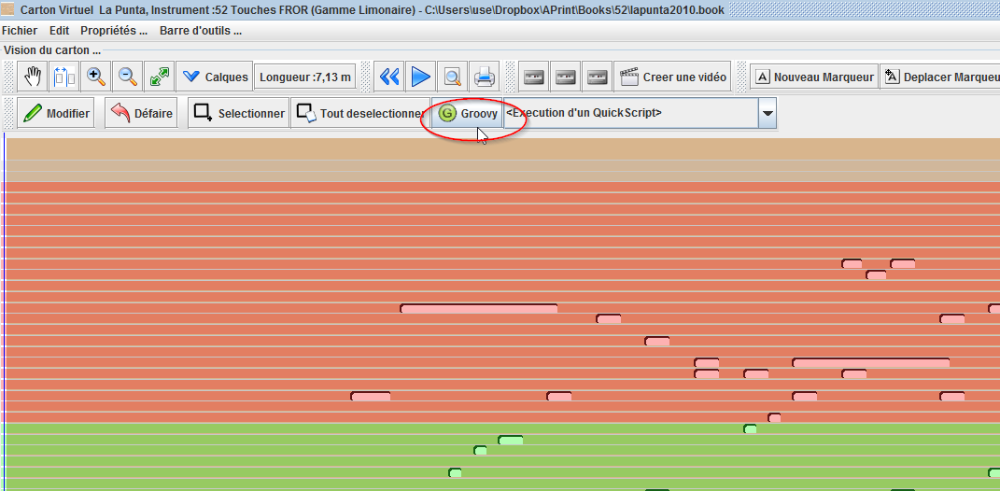
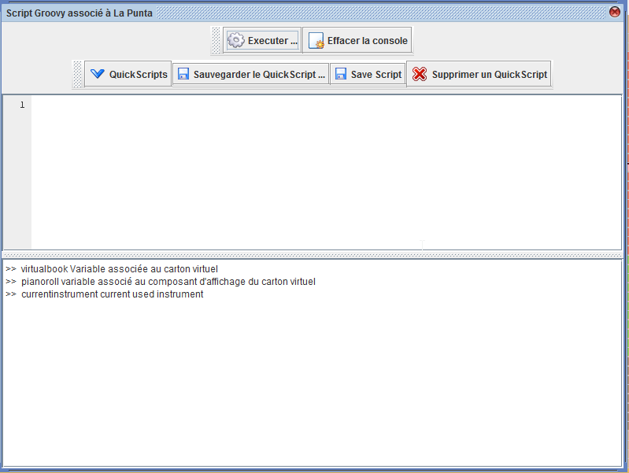
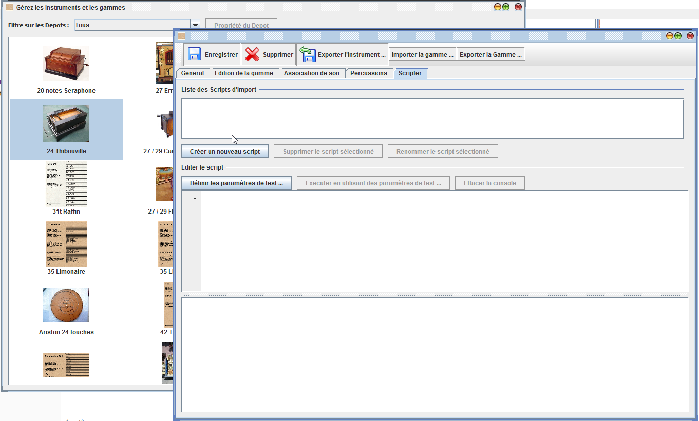

Scripting avec APrint
=====================

Bien que le logiciel permette de réaliser des cartons, certaines fonctionnalités n'ont pas été prévues ou même développées. APrint et APrint Studio intègrent un langage de script permettant de prototyper ou combler des manques dans le programme initial. Dans l'activité d'arrangement de cartons, il est fréquent de faire des manipulations qui n'ont pas été prévues, le langage de script permet d'ajouter des fonctionnalités facilement sans être développeur.

Plusieurs consoles de script ont été intégrées à des endroits stratégiques du logiciel. Il est ainsi possible de manipuler les instruments, le carton, les exports vidéo, la génération de gamme et tous les objets utilisés dans le logiciel. Il est également possible de créer des fenêtres pour faciliter l'utilisation de ces nouvelles fonctionnalités.

APrint utilise le language groovy comme moteur de scripts. Ce language simple à apprendre a une multitude d'exemples, tutoriels, informations de références sont disponibles sur le site de groovy à cette adresse http://groovy.codehaus.org/ . Ce langage basé sur Java permet d'exploiter tous les objets du logiciel APrint

L'utilisation du langage de script au sein du logiciel est réalisée dans des consoles, ces consoles donnent accès au contexte direct de l'application via des variables prédéfinies qui permettent d'accéder aux objets vivants de l'application (possibilité de piloter l'application).

Il est également possible d'utiliser principalement le langage de script (utilisation de la console Groovy) et d'y ajouter en référence les objets du logiciel APrint.

Plusieurs consoles sont disponibles dans le logiciel :

- Une console générale 
  - cette console permet la construction générale de scripts, non reliée à un carton donnée
- Une console carton (quickscript)
  - Cette console donne un accès au contenu du carton, des trous et permet de modifier le contenu directement, cet accès est souvent utilisé pour des modifications en masse du contenu du carton
- Une console pour la partie instrument (export / import / transformations).

Console générale d'APrint
-------------------------

Située dans le menu Outil, cette console permet d'effectuer des opérations générales non forcement liées à un carton. cette console générale permet entre autres d'automatiser l'import du fichier MIDI ainsi que toutes les tâches répétitives sur plusieurs objets du logiciel (instrument, cartons).

la fenetre de scripting propose deux panneau pour créer les programme et visualiser le resultat :

Dans l'écriture d'un programme, des variables importantes sont pré-déclarées pour donner accès au logiciel, la première variable définie est la variable `services` où le logiciel offre ses services au développeur.

plusieurs méthodes sont disponibles sur cette variable :

| Methode                                  | Description                              |      |
| ---------------------------------------- | ---------------------------------------- | ---- |
| Object **getOwnerForDialog** ()          | Récupération de la fenêtre globale, utilisée pour les fenêtres modales |      |
| Repository2 **getRepository** ()         | Récupération de l'objet contenant les instruments |      |
| void **newVirtualBook** (VirtualBook virtualBook, Instrument instrument) | crée une nouvelle fenêtre avec le carton et pour un instrument donné. |      |
| void **newVirtualBook** (VirtualBook virtualBook, Instrument instrument, IssueCollection collection) | crée une nouvelle fenêtre avec le carton et pour un instrument donné, avec éventuellement un passage des erreurs (issuecollection) |      |

il est donc possible : de créer des fenetres, récupérer la définition des instruments, créer une nouvelle fenetre de carton.

L'ensemble des objets du logiciel sont également accessibles, pour par exemple :

- lire des fichiers midi
- écrire des carton
- créer des videos
- ... etc

toutes les fonctionnalités du logiciel sont accessibles, il n'y a pas de restrictions.

## Console carton (quickscript)

Cette console est éxécutée à partir du bouton `Groovy` :

ce bouton affiche une fenetre pour créer des scripts en lien avec le carton :

Dans cette console, les variables prédéfinies sont les suivantes :

- virtualbook : donne accès au carton
- pianoroll: donne accès au composant visuel (permettant de récupérer par exemple une sélection de trous à modifier)
- currentinstrument : l'instrument courant

## Console dans l'instrument

Cette console est accessible dans la description d'un instrument, 

à cet endroit il est possible de créer des scripts d'import MIDI spécialisés, ou des scripts d'export MIDI (pour l'écoute).

cette console permet de redéfinir la façon dont on ajoute des fichiers midi dans le logiciel et de pouvoir s'adapter à des conventions d'arrangement ou récupération de pistes, canaux spécifiques, effectuer des transpositions .. etc ..