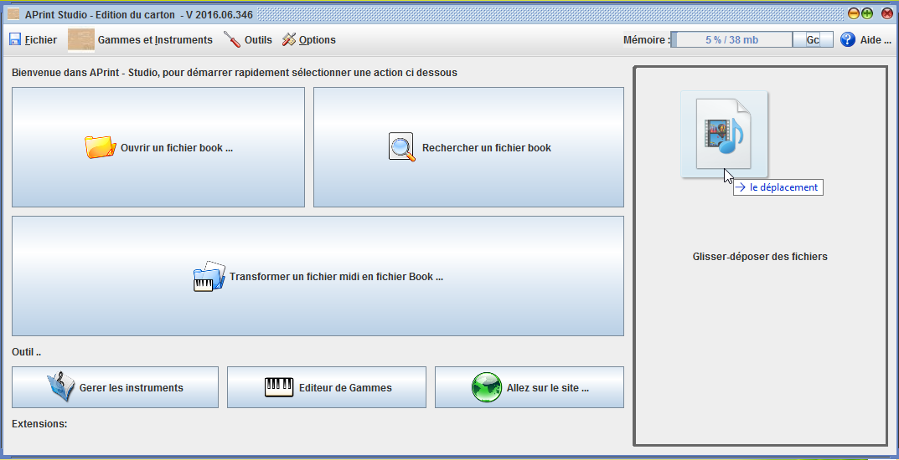
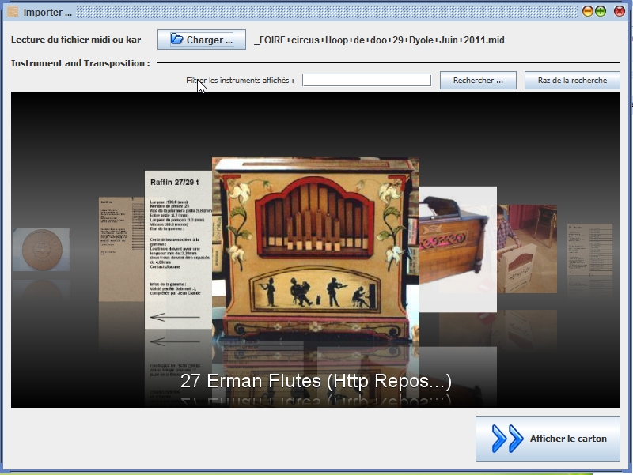
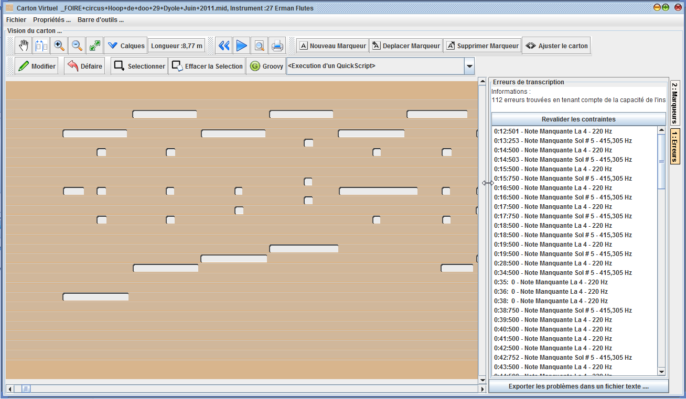

Premiers pas avec APrint studio
===============================

APrint studio est un outil proposé aux arrangeurs de cartons d'orgue de barbarie, celui-ci concerne et se concentre sur les dernières étapes de création de cartons. L'ensemble de l'arrangement musical est réalisé avec un autre logiciel musical (Harmony Assistant, Cubase, Sibellius ... etc). Pour pouvoir être ensuite utilisé dans APrint Studio, il est alors nécessaire de passer par le format Pivot MIDI pour pouvoir être transformé en carton virtuel sous APrint Studio.

La première étape du logiciel est donc la récupération d'une composition musicale réalisée avec un instrument avec un logiciel d'arrangement, que l'on souhaite finaliser en carton.

Premier Import à partir d'un fichier MIDI
-----------------------------------------

L'import est donc la première étape réalisée pour créer un carton, cette étape consiste à récupérer un arrangement musical d'un séquenceur MIDI pour le transformer en carton.

On préfèrera dans un premier temps importer un fichier MIDI sur l'instrument pour lequel il a été arrangé. Les changements d'instruments peuvent être envisagés par la suite, en utilisant les termes de base, accompagnement ou chant pour faire les conversions (c'est beaucoup plus pratique).

Pour réaliser l'import, le logiciel utilise la définition d'un instrument. Dans l'instrument, sa gamme définit la position des notes et les pistes associées à ces notes. Il est donc capable, en fonction des notes présentes dans le fichier MIDI, de les associer à une piste sur le carton. Les notes chevauchantes ou dupliquées sont conservées pour permettre leur correction. Cependant le jeu les supprime pour s'approcher au mieux de la réaction de l'instrument. L'export par défaut en MIDI par contre effectue une fusion des trous pour n'avoir au final qu'une seule note fusionnée pour l'ensemble des trous chevauchés.

Dans son fonctionnement, plusieurs transformations sont réalisées au préalable, afin de simplifier la récupération.

-   **Une première transformation est donc la fusion de l'ensemble des pistes du fichier MIDI**, ainsi les notes sont reconnues indépendemment de leur organisation dans le fichier MIDI, (cette stratégie donne le plus de résultats)

-   **La seconde transformation concerne les percussions**, en effet certaines percussions sont décalées par rapport à leur pilotage. Ceci est pris en charge par le logiciel dans la définition de la percussion (retard + longueur fixe).

    ​

    Glissez le fichier midi sur la fenêtre principale

La fenêtre de choix de l'instrument apparaît

Cliquez sur le bouton "Afficher le carton", pour terminer la transformation du fichier MIDI

Le carton associé au fichier midi est créé.

### Premier résultat d'import

Le premier import peut ne pas être très intéressant car la récupération du fichier MIDI ou la transformation est inadaptée. Il y a alors deux possibilités : soit adapter le fichier midi et ses notes ou faire un petit script pour spécifier comment adapter et lire le fichier MIDI. Tout dépend si l'opération est réalisée une seule ou plusieurs fois. Une section de cette aide est dédiée à la création d'un script d'import.

Plusieurs tentatives peuvent être nécessaires pour un bon résultat final.

### Adaptation des contraintes de l'instrument

Dans le panneau de droite, les contraintes associées à l'instrument (à partir de sa gamme) sont affchées, celles ci peuvent être recalculées au fur et à mesure de la progression du travail.
