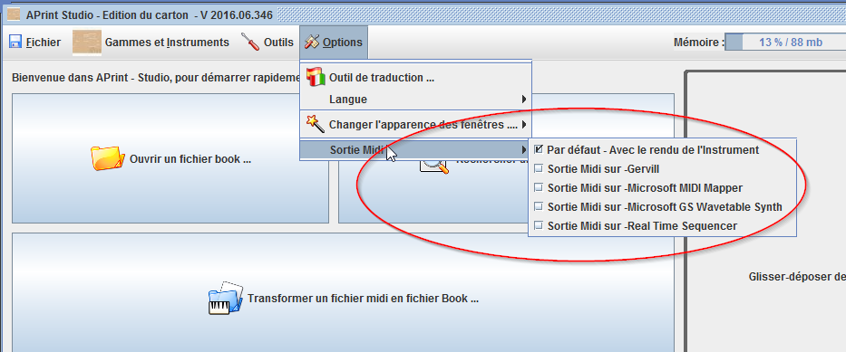

Piloter un instrument MIDI
==========================

APrint Studio permet le pilotage d'un instrument midi à partir du jeu de la vue carton (play). Le menu **Options** de la fenêtre principale permet la sélection du sous système de jeu utilisé pour la restitution sonore. Cette restitution peut être interne à l'ordinateur en utilisant une synthèse à partir des échantillons sonores de l'instrument. En sélectionnant une interfaçe MIDI, ou une sortie USB MIDI le jeu d'un carton pilotera alors directement l'instrument.

Transcription par défaut en MIDI d'un Carton Virtuel
----------------------------------------------------

Par défaut, la transcription en MIDI est effectuée à partir de la gamme de l'instrument, celle ci donne par défaut une correspondance MIDI pour : les notes (le code midi est utilisé), et les percussions (le code midi et nom de la percussion est utilisé pour la correspondance), les percussions sont envoyées sur le canal 10.

Transcription MIDI personnalisée par script dans un instrument
--------------------------------------------------------------

La transcription de carton vers midi peut être personnalisé pour s'adapter à la commande réelle de l'instrument. Il s'agit ici de faire la correspondance entre les pistes du carton et les ordres MIDI envoyés vers l'instrument.

Cette transcription personnalisé prend la forme d'un script associé à l'instrument et sauvegardé dans l'instrument utilisé avec le carton virtuel. Si plusieurs scripts existent, un choix de la transcription est proposé à l'utilisateur. Ces scripts peuvent être étendus et adaptés en fonction du pilotage de l'instrument.

Ci dessous un exemple de script réalisé pour piloter un instrument et ses registres avec des commandes MIDI spécifiques :

    import org.barrelorgandiscovery.playsubsystem.*
    import org.barrelorgandiscovery.virtualbook.transformation.importer.*
    import org.barrelorgandiscovery.virtualbook.*
    
    def vb = virtualbook;
    
    def notemapping = [:]
    
    for(int i = 0 ; i < 43 ; i ++)
    {
        def md = [channel : 13, note : 35 + 6 + i]
        notemapping[i] = md
    }
    
    // fin chant
    for (int i = 43 ; i < 51 ; i ++)
    {
        def md = [channel : 14, note : 20 + 35 + i - 43]
        notemapping[i] = md
    }
    
    // contre chant
    // DO
    notemapping[51] = [channel : 14, note : 55 + 51 - 43]
    // DO #
    notemapping[52] = [channel : 14, note : 55 + 52 - 43]
    
    // RE
    notemapping[53] = [channel : 14, note : 55 + 76 - 3 - 43 ]
    
    // RE#
    notemapping[54] = [channel : 14, note : 55 + 77 - 3 - 43]
    
    // MI
    notemapping[55] = [channel : 14, note : 55 + 78 - 3 - 43 ]
    
    // contre chant
    for (int i = 56 ; i < 76 ; i ++)
    {
        def md = [channel : 14, note : 55 + i - 3 - 43]
        notemapping[i] = md
    }
    
    // registres
    // channel 15 - (ou 14 à partir de zero)
    
    // declenche
    
    notemapping[77] = [channel :14 , note : 36]
    
    // registres, notation sur les broches
    
    def mregistre = [ 79 : [14 , 61] , //viloncell
                      80 : [15 , 57], //flute 8
    
                      82 : [14 , 57], // bourdon
                      83 : [14 , 59], // voix celeste
    
                      84 : [15 , 4], // sax
    
                      85 : [14 , 62], // flute dans le chant
                      86 : [14 , 51], //trompette
                      87 : [14 , 52], // udamaris
                      
                      88 : [14 , 50], // violon dans le chant
                      89 : [15 , 19], // xylophone dans le chant
                      90 : [14 , 62], // Flute harmonique
                      91 : [15 , 2], // Flute de 8
                      92 : [15 , 17], // accordeon
                      93 : [14 , 64], // forte
                       94 : [14 , 49], // bonrdon dans le chant
                       95 : [14 , 53] // vibraphone
                      
                     ]
                      
    mregistre.each { k, v -> 
    
       notemapping[k - 1] = [channel : v[0] - 1 , note : v[1] + 35]
    
    }
    
    // percussions
    
    for (int i = 96; i <= 105 ; i ++)
    {
        notemapping[i] = [channel : 14, note : 55 + (80 + i - 96) - 3 - 43 ]
    }
    
    def m = new MidiFile()
    
    def holes = vb.getHolesCopy()
    
    // declanche ON
    byte[] data = [ 0x9E, 36,127  ]
    def n = new MidiGenericEvent(0, data)
    m.add(n)
    
    holes.each {
    
        def nn = notemapping[it.track]
        if (nn != null)
        {
        
           if (nn == 77)
           {
              // declenche
              // off , puis on
              byte[] data1 = [ 0x8E, 36,127  ]
              m.add( new MidiGenericEvent(it.timestamp, data1) )
              
              byte[] data2 = [ 0x9E, 36,127  ]
              m.add( new MidiGenericEvent(it.timestamp + it.length, data2) )          
                     
           } else 
           {
               def n2 = new MidiNote(it.timestamp, it.length, nn.note, 0 , nn.channel)
               m.add(n2)
           }
        }
    
    }
    
    return m
