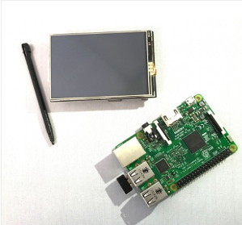
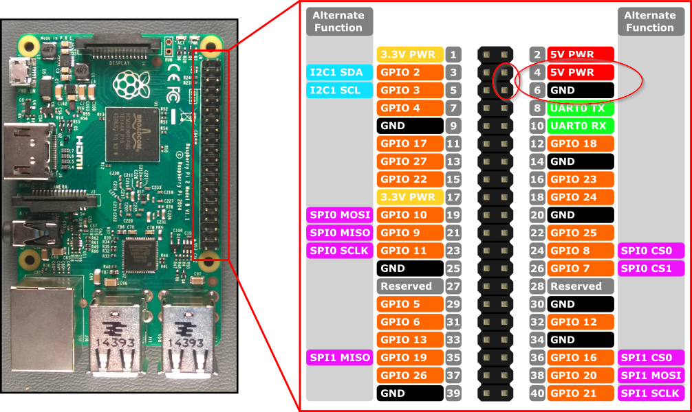
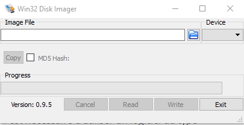

# APrint Commander - Installation

*Patrice Freydiere* - Mai 2019

L'installation est simple, car utilise du matériel standard, directement accessible des marchant électronique. Seul la connection électrique peut nécessiter une ou deux soudures.

La partie logicielles est intégrée dans une image de carte SD, qu'il faut écrire sur le support.

# Matériel nécessaire

APrint commander repose sur un boitier raspberry PI 3, avec un petit écran LCD.

Les composants sont :

- RPI Model 3 – QuadCore – 1Gb 	de RAM
- Ecran LCD 3.5, Driver ILI 9486 – 	320x480 – Touch – SKU:MPI3501
- Carte microSD - 16gb

# Mise en place sur la machine

Le boitier RPI doit être alimenté en 5V avec un ampérage associé. Si l'alimentation est trop faible (moins de 1A), le pilotage machine ne sera pas réalisé. En effet la partie commande GRBL est alimentée en électrique par le port USB.

Il est donc recommandé de câbler l'alimentation du boitier.

# Installation de la carte SD

Pour utiliser le APrint Commander, il faut une carte SD, de taille 64 gb. Une image de la carte SD est disponible sur le site WEB.

Pour écrire le contenu de la carte SD, il est nécessaire d'utiliser un logiciel du type [Win32DiskImager](Win32DiskImager-0.9.5-binary.zip), 

Etapes :

1 - Dans la boite "Image File", sélectionnez le fichier Image SD , de APrintCommander

2 - Dans la boite "Device", sélectionnez le lecteur associé à la carte

3 - Appuyez sur le bouton "Write" pour écrire l'image sur la carte SD

La carte SD est prête à l'utilisation, Branchez le boitiez et démarrez le boitier, l'écran suivant doit apparaître :

