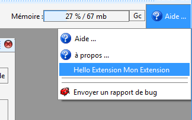

Développer des extensions logicielles en Java
=============================================


Le développement d'extensions logicielles permet d'ajouter des fonctionnalités qui peuvent être distribuées séparément du logiciel.

Les extensions, plus difficiles à implémenter apportent néanmoins de grands atouts dans le développement de fonctionnalités. Leur développement est réalisé avec des outils de professionnels qui permettent de construire des fonctionnalités avec une bonne qualité logicielle.

Plusieurs outils de développement Java peuvent être utilisés. Par exemple, l'environnement éclipse est un bon candidat.

Dans le logiciel APrint studio, un mécanisme de chargement de classe à l'initialisation du logiciel permet de créer de nouveaux boutons, de nouveaux outils pour manipuler le carton ou permettre un affichage sur la vue cartons.


Qu'est-ce qu'une extension ?
----------------------------

Une extension est un ensemble de classes Java qui sont rassemblées dans un fichier d'archive Java (fichier .jar). Le fichier d'archive est aisément construit à partir de l'environnement de développement.

Ce fichier, une fois dans le répertoire du profil utilisateur, est chargé au démarrage de l'application.


Analyse d'une première extension
--------------------------------

Regardons tout d'abord comment implémenter une extension permettant d'ajouter de nouvelles barres d'outils dans le carton, ou des éléments sur le carton lui-même. Une simplification a été réalisée pour permettre en une classe Java de créer une extension. Nous allons voir ci-dessous comment utiliser ce principe. D'autres méthodes plus riches peuvent également être utilisées, cependant celles-ci étant plus complexes, elles pourront être vues dans un deuxième temps.

La forme la plus simple d'une extension est une classe Java qui dérive de la classe

    org.barrelorgandiscovery.gui.aprintng.helper.BaseVirtualBookExtension

Cette classe implémente les méthodes qui sont laissées à la discrétion du développeur. L'implémentation des méthodes permet d'effectuer différentes choses.

Analysons les méthodes de cette classe :

    /**
     * Override this method for giving a name to the extension
     */
    public abstract String getName();
    
    /**
     * Override an add wished help Menu commands (about for example)
     */
    public abstract void addHelpMenuItem(JMenu helpMenu);
    
    /**
     * Override this method to add a new toolbar to the virtualbook window
     */
    public abstract JToolBar[] addToolBars();
    
    /**
     * Override this method to add new layer on the book component
     */
    public abstract void addLayers(JVirtualBookScrollableComponent c);

La première méthode (getName) permet de retourner le nom de l'extension.

Les autres méthodes permettent de déclarer: de nouveaux éléments dans le menu d'aide (addHelpMenuItem), d'ajouter des barres d'outils dans la vue carton (addToolBars), d'ajouter des éléments graphiques dans le composant de carton (addLayers).

Nota : Il faut savoir que les développements réalisés en interface graphique sont basés sur swing, tous les composants débutant par la lettre J sont des composants swing. La documentation complète de ces composants est disponible dans le Kit de développement Java. des tutoriels peuvent également être trouvés sur Internet.


1 - Première étape, création d'un bouton de menu d'aide.
--------------------------------------------------------

Pour créer la première extension, il faut dans votre environnement de développement, créer un nouveau projet Java qui utilisera la bibliothèque APrint situé dans le répertoire d'installation du logiciel. Ce fichier .Jar intègre également les sources du logiciel pour permettre une analyse plus profonde en cas de difficultés.

Le projet contient un packetage nommé aprintextension.

le projet contient également un fichier de propriétés à la racine nommé extensionsng.properties

Le projet doit ressembler à l'image ci-dessous :


Commençons par créer une classe squelette avec l'implémentation de la première méthode :

    package aprintextension;

```java
import java.awt.event.ActionEvent;
import java.awt.event.ActionListener;

import javax.swing.JMenu;
import javax.swing.JMenuItem;
import javax.swing.JOptionPane;
import javax.swing.JToolBar;

import org.barrelorgandiscovery.gui.aedit.JVirtualBookScrollableComponent;
import org.barrelorgandiscovery.gui.aprintng.helper.BaseVirtualBookExtension;

public class MyExtension extends BaseVirtualBookExtension {

  public MyExtension() throws Exception {
     super();
  }

  @Override
  public void addHelpMenuItem(JMenu helpMenu) {

    JMenuItem it = helpMenu.add("Hello Extension " + getName());
    it.addActionListener(new ActionListener(){
           @Override
           public void actionPerformed(ActionEvent e) {
                   JOptionPane.showMessageDialog(null, "Hello Extension");
           }
    });
  }

  @Override
  public String getName() {
      return "Mon Extension";
  }

  @Override
  public void addLayers(JVirtualBookScrollableComponent c) {

  }

  @Override
  public JToolBar[] addToolBars() {
     return null;
  }

}
```


2 - Renseigner le fichier de propriétés
---------------------------------------

Lors du chargement, les classes que l'application doit charger sont renseignées dans le fichier de propriété. Nous avons renseigné le nôtre comme ceci :

    extensions=aprintextension.MyExtension

Si d'autres extensions doivent être chargées, les noms des classes sont séparés par une virgule.


3 - Création du fichier d'archive
---------------------------------

Le fichier d'archive peut être créé à partir de l'environnement de développement. Celui ci doit inclure la classe compilée et le fichier de propriété


4 - Test de l'extension
-----------------------

Le démarrage et le test se fait directement à partir de l'outil de développement, il faut lancer dans le contexte du projet la classe principale d'APrint Studio, ceci se configure dans Eclipse comme ceci :


5 - Résultat
------------




Le fichier .Jar une fois finalisé peut être distribué pour fournir des fonctionnalités supplémentaires, les utilisateurs placeront alors ce fichier à la racine du répertoire Aprintstudio de leur profil utilisateur (répertoire Home pour les unixiens ou sur Mac)
