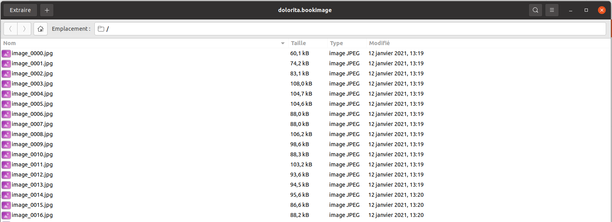
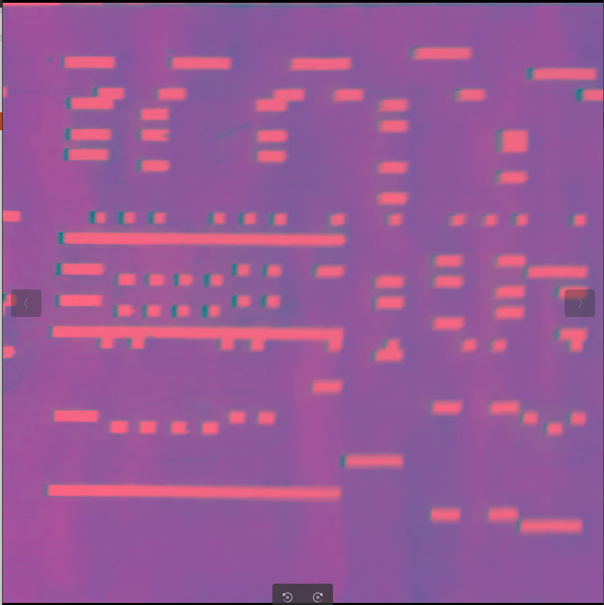

# Le format de fichier bookimage

Depuis la version APrint Studio 2020, un nouveau type de fichier a été ajouté : le fichier `.bookimage` 

Dans la continuité des formats de fichier introduit, ce type de fichier, basé sur le format `zip`, contient les numérisations des cartons, calé sur la gamme, et permettant de pouvoir récupérer l'entièreté des annotations et de la fabrication des cartons. 

Très important dans la numérisation de carton, ce format permet la superposition des fichier .book, avec l'image sous jacente pour permettre de récupérer les trous et les spécificité des cartons d'origine. Tantôt sous la forme de poncifs, ou de cartons sortant des manufactures. 

Fort du retour d'expérience sur les fichiers images avec des dimensions très longues, et difficilement utilisables dans les logiciels traditionnels, les images sont découpée ici dans ce format de fichier, pour bénéficier : des pyramidages et optimisation d'affichage (en effet pour montrer une toute petite partie du carton, il n'est pas nécessaire ici de lire l'ensemble de l'image). Ce découpage permet également dans la compression utilisée, de pouvoir optimiser le stockage, en ne prenant en compte que les spécificités de la partie d'image enregistrées (contrairement aux formats d'images globaux). 

## Description du format de fichier .bookimage

Renommé en .zip , celui ci contient des dalles, calées sur la largeur de la gamme, et contenant des imagettes pouvant être mises "bout à bout", pour reconstituer des cartons longs de plusieurs kilomètres.

Chaque image est nommée comme suit : `image_[no image].jpg` comme observé ci dessous

Chaque imagette du carton, est une dalle carrée (dont la résolution peut varier en fonction de la méthode d'acquisition), et dont la hauteur est calée sur la description de la gamme.

ci dessous un exemple de dalle (fichier image_0003.jpg), ici enregistré au format JPEG, pouvant contenir un canal Alpha (d'où les couleur observée ici par l'afficheur d'image). 

Depuis le fix 2020, les images JPEGS sont maintenant enregistrées SANS canal Alpha. en Effet plusieurs visionneuses d'images ne proposent pas le support de ce canal alpha, (non forcement généralisé sur ce type de format JPEG).

## Extension futures

Dans les extensions future, un fichier texte associé et stocké dans le fichier zip, permettra de pouvoir avoir la gamme et description de l'instrument pour lequel le carton a été numérisé. Pour l'instant cette association est réalisée par l'utilisateur dans la suite APrint.

