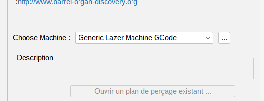
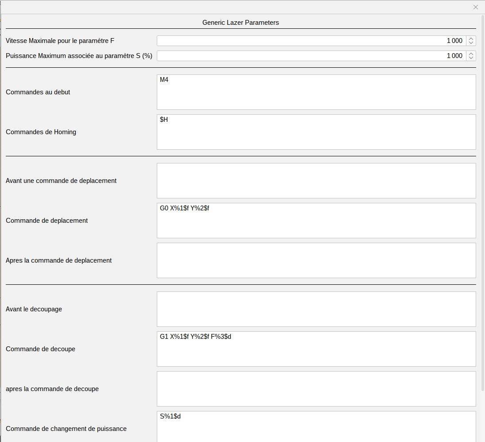

# Générer un gcode paramétré pour les CNC laser

*Depuis la version 2023, - Pierre Louis*

 

APrint propose une génération de GCode paramétrable pour les CNC laser. 

Même si cette machine ne permet qu'une génération de gcode dans un fichier, les différents ordre de génération sont prévus pour être paramétrables, et donc d'adapter aux différents besoins des controlleurs de CNC (Mach3, ...)

Cette nouvelle machine est alors trouvée dans le panneau de perforation, 

Le paramétrage de la machine propose alors une saisie des différents ordre GCode. 

Par défaut le paramétrage reprends la configuration de GRBL, en mode laser. 

Dans le paramétrage, les différentes phases de génération son présentées, avec une possibilité de "pre" commande et de "post" commande, qui sont réalisé avant l'ordre.

Pour la génération des ordres, nécessitant les coordonnées X, ou Y , un formalisme permet de positionner la coordonnées dans l'ordre saisi :

%1$f pour le paramètre X

%2$f pour le paramètre Y

%3$f pour le paramètre F (vitesse de déplacement)

et %4$f pour le paramètre de puissance (uniquement dans la définition de la découpe, celui ci n'est pas disponible pour les déplacement).

