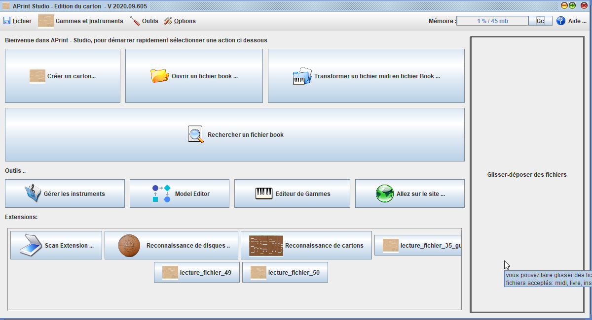

# Récupérer un instrument existant

par Freddy Meyer

APrint s’occupe de tous les paramètres de votre orgue (téléchargeable depuis une bibliothèque) avec toutes les subtilités que je vais vous expliquer pour une utilisation des plus aisées.

[Video d'explication](https://www.youtube.com/watch?v=95aqUBCLP54&t=1s)

## Ouvrir APrint et importer un instrument

Avant toute chose, il faudra importer l’instrument pour lequel vous voulez perforer le carton. Vous aurez ainsi tous les paramètres (nombres de touches, pas, mesure depuis le bord de référence…)
Je vais prendre l’exemple d’un 27/29 touches pneumatique.
A l’ouverture de APrint, cliquer sur le bouton « Aller sur le site »

Un clic gauche sur l’instrument fera apparaître une adresse

Clic gauche maintenu, glisser simplement cette adresse dans la fenêtre « glisser – déposer des fichiers » dans la fenêtre d’APrint. Il faudra bien sûr s’arranger pour que les deux pages soient visibles. Au bout de quelques instants vous aurez l’indication  « instrument importé avec succès ».

