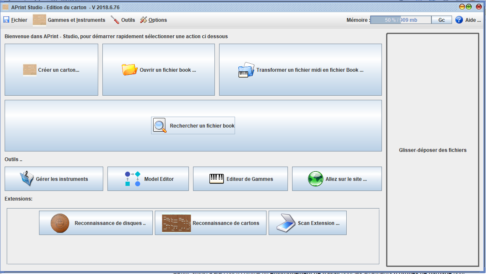

Bienvenue dans l'aide en ligne du programme APrint Studio
=========================================================

APrint / Studio
---------------------------

APrint Studio a été concu comme un **environnement de travail** pour les arrangeurs **d'orgues de barbarie** pour faciliter la **création** et **récupération** de morceaux de musique. Le logiciel permet la vérification de la notation musical en fonction des capacités des instruments de musique mécanique. 

Une attention toute particulière est donnée à la simplicité d'utilisation (grand public / amateur / professionnel).

APrint Studio est réalisé en tant que **logiciel Libre**, permettant aux utilisateurs d'adapter le programme en fonction de leurs besoins. Le code source du programme est accessible dans chaque installation, dans le fichier .jar (archive ZIP).

Un mécanisme d'extension et de scripts permet de brancher des fonctionnalités dans le logiciel sans avoir à connaitre fondamentalement tous les détails du fonctionnement. Ceci permet d'ajouter la ou les fonctions manquante(s) assez simplement.

Concepts
------------------------

Même si le format MIDI reste très utilisé pour le format numérique de définition de carton, ce format n'est pas bien adapté à la musique mécanique traditionnelle. En effet, la composition et la registration de cartons d'orgues de barbarie requiert des spécificités qu'il est difficile d'inclure dans le format MIDI. Il peut y avoir plusieurs interprétations possibles sur la façon de mettre en place ces spécificités (registres, commandes diverses).

L'utilisation des sons réels d'instruments influe également de façon importante sur la composition ou l'arrangement de morceaux spécifiquement écrits pour les orgues de barbarie.

J'espère pouvoir offrir les fonctionnalités permettant aux arrangeurs / amateurs de pouvoir utiliser au mieux toutes les capacités des instruments d'orgue de barbarie et éventuellement déclencher des vocations pour faire vivre ces instruments merveilleux.

Utilisation
-----------

APrint Studio a été testée et est utilisé sur les OS suivants (Windows XP/Vista/8/10, Linux, Mac).

APrint Studio utilise Java 8
