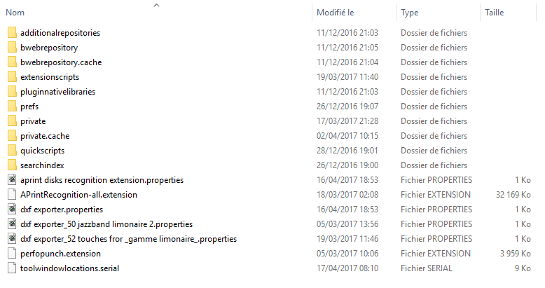
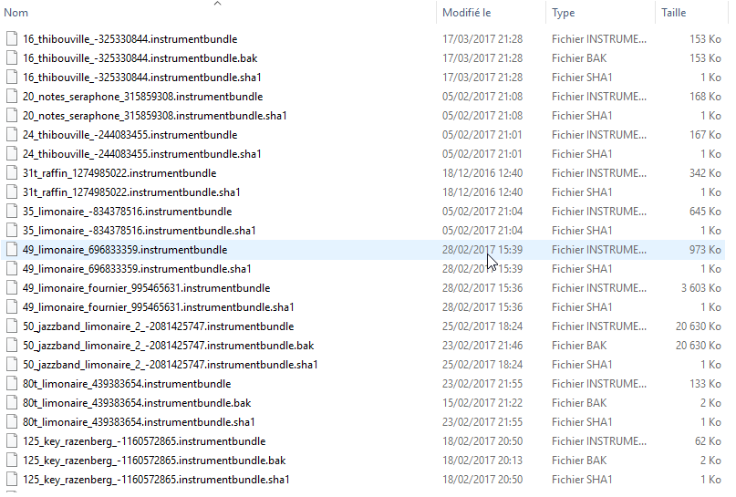

# Description du répertoire de fichiers APrint Studio

Conformément à la rubrique [Installation](mdwiki.html#!installation/installation.md), APrint utilise un répertoire dédié pour l'utilisateur pour le stockage des différentes informations associées au logiciel.

Situé initialement dans le répertoire "**aprintstudio**" du profil utilisateur, celui ci peut être déplacé ou renommé à partir de la version 2017, en l'indiquant dans l'installeur windows ou sur la ligne de commande pour linux et macOsX

## Détails du contenu du répertoire

on trouve dans ce répertoire plusieurs fichiers / répertoire

### Fichiers .extensions et .extensionlazy

Ces fichiers contiennent des extentions logicielles apportant de nouvelles fonctionnalités, ces fichiers sont disposés dans le répertoire aprintstudio et sont automatiquement chargés lors du démarrage d'APrint. 

### Répertoires private, private.cache

Ce répertoire contient la liste des instruments privés utilisés ou créés par l'utilisateur. 

les fichiers .instrumentbundle sont des fichiers zip, contenant la définition d'un instrument complet (gamme, sons, définition ... ). les fichiers .bak sont des sauvegardes du fichier instrument, permettant en cas de perte de revenir à une version antérieur.

un fichier de controle .sha1 permet uns détection de changement du fichier, ce fichier est géré automatiquement et recréé si non existant.

Au démarrage du programme ce répertoire est scanné pour détecter les instruments. Une structure de cache est créé si non existante (dans le répertoire private.cache), pour accélérer la prise en main des instruments par le logiciel. par exemple, on retrouve dans la structure des caches, la construction des banques de sons SF2 (soundfont 2 ), utilisé pour le jeu des cartons.

Le répertoire private.cache est entretenu automatiquement et recréé si non présent pour accélérer l'utilisation.

### Répertoire quickscript

Ce répertoire contient l'ensemble des quickscripts disponible dans le logiciel, pour plus d'information vous pouvez vous référer à la rubrique "extension par script".

Ce répertoire est lu au redémarrage du logiciel. 

### Répertoire bwebrepository

Ce répertoire contient les instrument récupéré sur le web, il a exactement la même structure que le répertoire private et private.cache.

### Répertoire extensionscript

Ce répertoire contient la liste des extensions présentées en page principale du logiciel.

### Répertoire searchindex

Contient l'indexation des cartons virtuels réalisée dans le logiciel pour une recherche.

### Fichiers .properties

Ces fichiers sont des propriétés associées a l'utilisateur, mémorisation des préférences utilisation pour le logiciel et les différentes extensions.