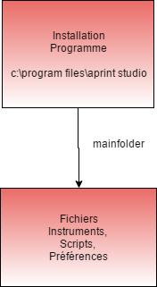

# Installation

APrint Studio contient une installation intégrée pour les version windows, 

## Installation Avancée

Depuis la version 2017, une option avancées permet de choisir pour l'installation donnée, le répertoire contenant les fichiers utilisateurs

plusieurs usages sont couvert avec cette possibilité :

- installation de plusieurs version indépendantes (par exemple, la dernière version et une version utilisée en production).
- choix de plusieurs configurations

### Installation conjointe de plusieures version APrint Studio

Par défaut lors de l'installation APrint Studio, l'ensemble des informations d'instruments, de gammes, et paramétrages sont stockés dans le répertoire `aprintstudio` situé dans le répertoire **utilisateur** (dans c:\users\\[utilisateur]\\aprintstudio pour windows, ou /home/[utilisateur]/aprintstudio)

Il est possible de spécifier un répertoire de configuration dédié à une nouvelle installation, pour permettre l'installation de deux versions différentes sur le même ordinateur.

Ceci est possible en ajoutant un paramètre `-Dmainfolder=c:\aprintstudio` , dans la ligne de commande d'éxécution.

Le répertoire d'instrument, script, préférence est créé automatiquement au premier démarrage

