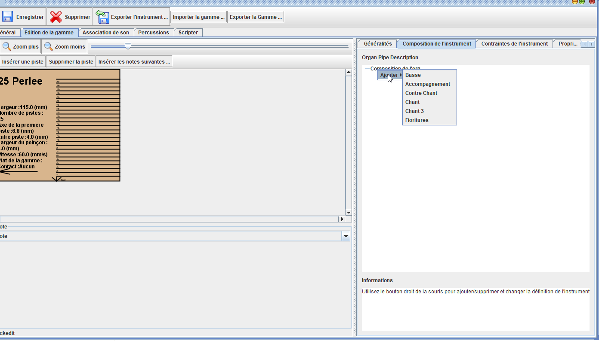

# Creer et définir un nouvel instrument

*Patrice Freydiere - Decembre 2020*

<<<<<<< HEAD
Une bibliothèque d'instruments est [accessible à partir du site web](http://www.barrel-organ-discovery.org/instruments/),  [cet article également, vous indique comment les récupérer et les utiliser dans le logiciel](https://barrelorgandiscovery.github.io/APrintDoc/product/getinstruments/). 

Pour créer un nouvel instrument, il vous faudra :
=======
Une bibliothèque d'instruments présaisis sont [accessible à partir du site web](http://www.barrel-organ-discovery.org/instruments/),  [cet article également, vous indique comment les récupérer et les utiliser dans le logiciel](https://barrelorgandiscovery.github.io/APrintDoc/product/getinstruments/). 

Vous pouvez donc partir d'un instrument et l'ajuster, ou en créer un nouveau. Pour créer un instrument, il vous faudra :
>>>>>>> 449cf87d264ac8b37efe6a020f343e8ecf1006c2

- Les caractéristiques de la gammes (dimensions, distance inter-piste, distance de la 1ere piste par rapport à la 1ere piste)
- La signification des pistes (notes, percussion, registration)
- éventuellement des échantillons sonores (fichier sons wav) pour donner de la voix à l'instrument dans l'écoute.

Les sons ne sont pas nécessaires si vous n'utilisez que la perforation, néanmoins, cela permet de valider à l'écoute les fichiers midi importés (et on peut avoir des surprises).

## Création d'un instrument

La gestion des instruments est accessible depuis le menu principal :

Cette fonction vous donne accès à la fenetre de gestion des instruments :

Les instruments existants sont présentés.

### Les entrepots d'instruments

Les instruments sont organisés en "**entrepots**", ceci permet de pouvoir distribuer differemment les définitions d'instruments. 

Plusieurs types d'instruments sont disponibles :

- Entrepot "Privé": créé uniquement par l'utilisateur
- Entrepot "Web": une URL permet de synchroniser les instruments à un endroit donné (permet la constitution de banque de définition d'instrument)
- Entrepot "builtin": proposition d'instruments très utilisés, et diffusés au premier démarrage du logiciel.

la sélection de l'entrepot est réalisé par la combo box situé en haut :

**Nota**: les instrument sont Modifiables UNIQUEMENT en privé

Vous devez donc sélectionner "Instruments personnels: private", pour avoir accès aux fonctions de modifications.

Les instrument modifiables sont sauvegardés dans le répertoire de données d'aprint, dans le sous répertoire "**private**", référez vous alors à la rubrique d'installation pour en savoir plus sur ce répertoire.

Des boutons vous permettent alors de créer, modifier, ou supprimer un instrument

## Etapes de création d'un nouvel instrument

L'appui sur le bouton **Nouveau ..** permet de créer un nouvel instrument. On saisi le nom de l'instrument, et une description. Voir on y associe une image pour retrouver rapidement l'instrument dans les listes

## Définition des dimensions et caractéristiques techniques

Les dimensions de la gamme sont définies par les éléments suivants :

Le choix de la référence est définie par le talon. ce choix de référence est fait dans la définition de gamme, et son repérage est effectué avec la flèche reference.

## Définition des jeux de tuyau et registres

L'instrument a plusieurs jeux de tuyau, cette définition se fait dans la composition de l'instrument.

avec le bouton droit de la souris on ajoute des jeux de registres, qui seront utilisés pour les sons, et la coloration dans la vue carton.

Voila, 

## Définition du role des pistes

Une fois que la géométrie est posée, il est possible en sélectionnant une piste dans la gamme, il est possible avec le panneau en bas de définir le role des pistes.

Nous pouvons alors définir le role de toutes les pistes :

## Définition des sons

Pour permettre l'écoute de l'instrument, il est possible d'ajouter un son associé aux différents jeux.

Il est possible d'ajouter dans l'onglet "Association de son", un fichier wav. Le son alors ajouté, initialement assigné à une note particulière, peut être étendu à plusieures notes par "glissé déposé" au niveau du clavier, 

<<<<<<< HEAD

=======
>>>>>>> 449cf87d264ac8b37efe6a020f343e8ecf1006c2
