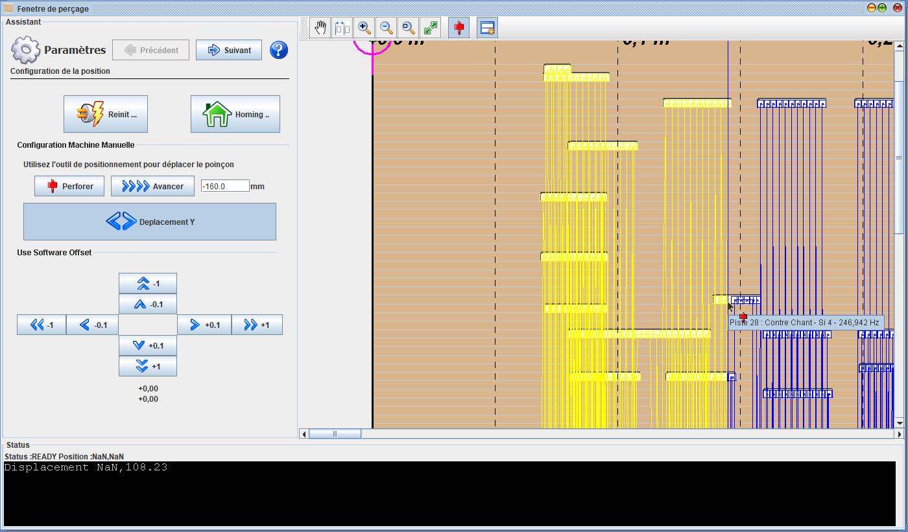
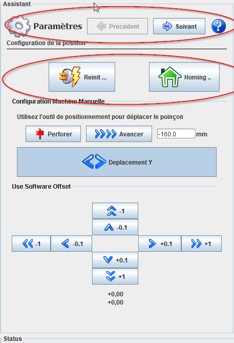
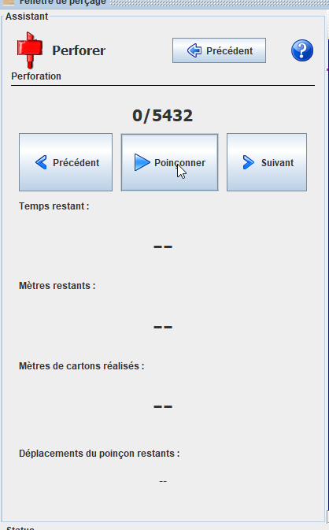
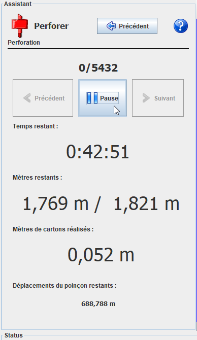
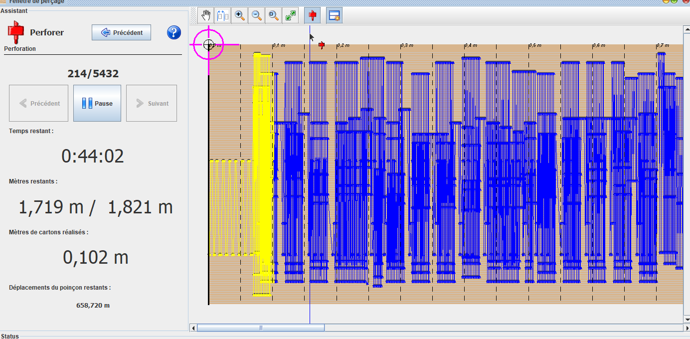

# Pilotage Machine

Via la fenetre de perforation, APrint permet la perforation directe du carton, (laser ou punch).

Une particularité importante est que APrint, permet de reprendre la perforation, de façon interactive. Depuis la version 2020, une fenetre console a été ajoutée, pour consulter les ordres GRBL de pilotage machine.

### Description des outils

Deux phases dans la perforation : une première phase de réglage de la machine (initialisation / réinitialisation), puis le lancement de la perforation

Les boutons précédent et suivant permettent de passer d'une étape à l'autre, entre l'initialisation et la performation.

La krunch nécessite un Homing pour pouvoir sortir du mode "Alarm" initial. Le bouton Homing permet le déclenchement de la fonction `$H`  initialisant le homing de la machine.

En appuyant sur "Suivant", l'utilisateur peut alors déclencher le perçage en utilisant le bouton "**Poinçonner**"

Le logiciel indique l'estimation du temps restant et du métrage restant également. 

### Modification de la position de départ

Dans la vue carton associé, des outils permettent de repositionner le poinçon, ou définir la position de départ. 

En jaune apparait les déplacements et poinçonnages déjà réalisés.

