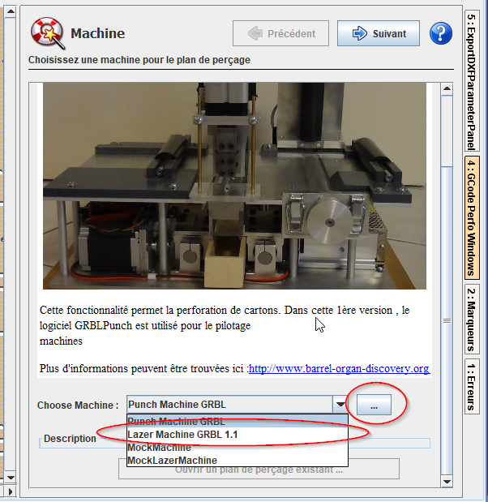
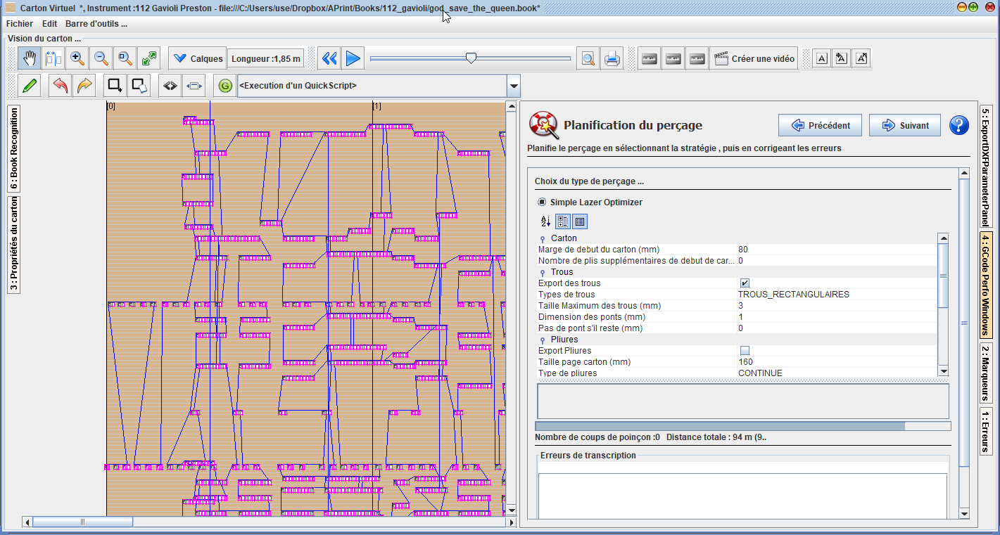
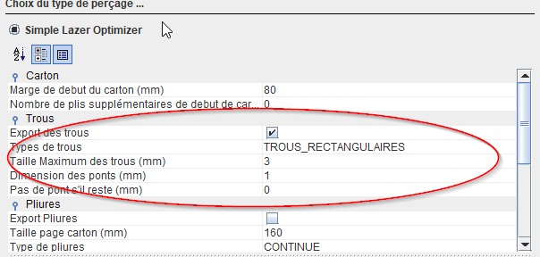
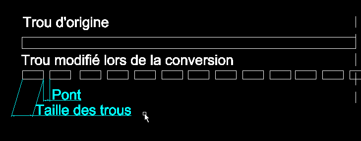
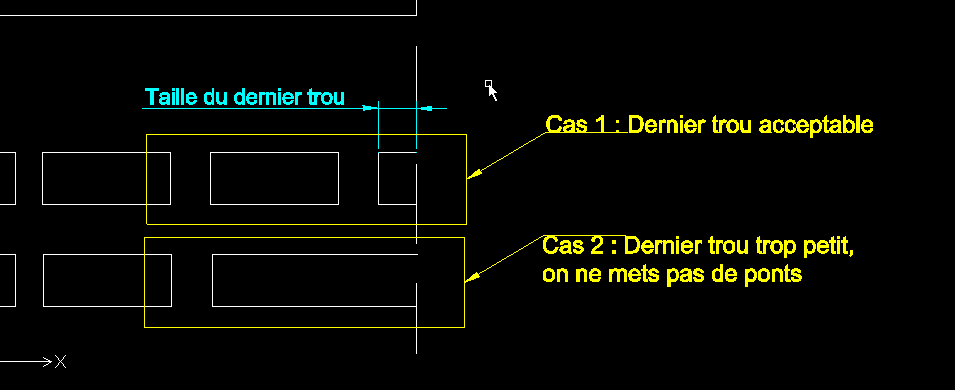
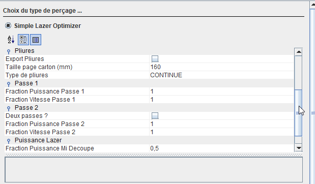

# Perforation laser

La perforation Laser est intégrée dans la version 2020. Autrefois mis en place via des scripts d'export DXF (fichiers utilisable dans les logiciels spécifiques Laser), cette capacité a maintenant été intégrée dans le fonctionnement standard du logiciel.

<video src="../2020-09_preview_lazer_aprint2020.mp4" />

En utilisation réelle

<video src="../video-1600703608.mp4" />

### MiddleWare GRBL

L'utilisation des fonctions de perçage nécessite l'utilisation du GRBL 1.1 avec l'activation du mode laser. 

### Activation et paramétrage perfo laser

La perforation lazer est réalisée, à partir de la fenetre de perforation du carton

Les paramètrages de du mode lazer sont accessible dans le bouton "...".

### Paramétrage du lazer et de la puissance

Les paraamétrage de puissance `SXXXX`  et de vitesse `FXXXXX` sont réglés initialement dans la fenetre de paramétrage du lazer. Ce sont les valeures MAXIMALES qui sont spécifiées.

Ainsi dans les autres parmétrages utilisés dans les propriétés de planification, il sera retenu la définition de la fraction de la puissance MAXIMALE.

Par exemple, si dans la vitesse maximale, la valeur 500 est retenue, en paramétrant ensuite une fraction de 0.5, la puissance retenue sera donné par la valeur 500 * 0.5 = 250 pour l'envoi machine.

## Planification de découpe laser

Nous retrouvons dans la fenêtre de paramétrage, les préférences de découpe et d'optimisation.

les paramétrages de taille max de découpe, ponts, ou espacement entre les ponts, permettent de régler la découpe pour les instruments mécaniques ou pneumatiques. 

L'affichage est actualisé en temps réel en fonction des paramètres saisie, permettant de controler le resultat.

#### Choix des paramètres de découpe

Le choix de l'export des trous, permet de préparer une découpe uniquement avec les pliures. Il a été constaté que la réalisation des pliures, sans allers et retours améliorait la régularité des pages de cartons et donc l'apparence du carton une fois pliée (les cartons ne font pas l'accordéon une fois pliés).

La taille des trous et pont, permettent de définir le resultat comme suit :

#### Gestion des fins de trous

#### Choix des pliures

Des paramètres de pliures, permettent de définir des pliures sous forme de pointillés, découpe à "mi chair", ou une alternance des deux. 

#### Plusieures passes pour la découpe des trous

Plusieures passent de découpe peuvent être réaliseé pour les trous, ou les pliures, en fonction de la puissance maximale du lazer.

Le choix d'utilisation de la 2eme passe est réalisée par l'activation de la coche 'deux passes', les facteurs de réglage de la vitesse et de la puissance peuvent être spécifiés. 