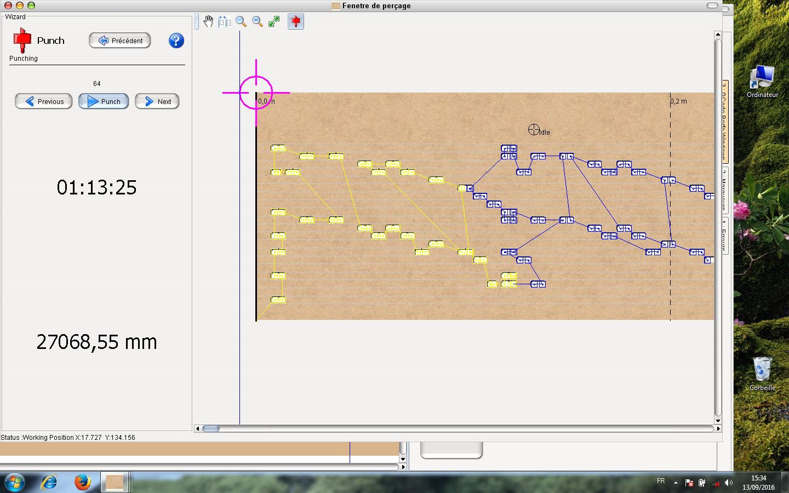

#Utilisation APrint Studio pour le perçage

par Freddy Meyer

**APrint Studio** transforme, en quelques clics,  les fichiers **midi** en **Gcode** (code utilisé dans les machines industrielles à commande numérique), gage d’une très bonne précision même à grande vitesse.

Sur visualisation du carton. Ici, j’en profite pour dire que les notes plus petites que 3 mm	 ne seront pas perforées. Ceci n’est bien sûr pas envisageable. Si ces notes y sont, c’est qu’elles ont une raison d’être.
Alors comment résoudre ce problème ? Rien de plus simple ! Dans la fenêtre « Quickscript », il faudra cliquer sur **«agrandir à 3 mm les trous plus petits»**
Je vous laisse découvrir les autres fonctionnalités et les divers onglets de cette page. 

Une nouvelle fenêtre va s’ouvrir et qui confirmera que les trous ont été agrandis

## Utilisation du panneau de perforation

Cliquez ensuite sur le bouton **«Gcode perfo windows»** situé sur la droite de la fenêtre de carton.

Là, plusieurs options sont à votre disposition
En cochant **«Optimisé en déplacement»**, le carton va faire des allers – retours, ce qui diminue considérablement le temps de poinçonnage.

Le bouton « sans retours » ne fait qu’avancer le carton. Cette option est utilisée pour les papiers perforés qui se plieraient lors du retour.

Mm abandonné permet de ne pas perforer une fin de note. En gros, si une note fait 6,1 mm, on pourrait ne perforer que 6 mm. Mettre la valeur 0

Mm de recouvrement permet de faire revenir le poinçon légèrement en arrière pour être sûr que le trou soit bien propre. Cette fonction est surtout utile pour les poinçons carrés et les cartons pour lecture mécanique.

A l’inverse, pour du papier ou du carton pour pneumatique, il est conseillé de faire des ponts entre chaque trou. Il faudra donc donner les valeurs suivantes **«  - 1 »** ou  **« - 1,1 »**. On aura ainsi un pont de 1 ou 1,1 mm.

Taille du poinçon sera la dimension de votre poinçon 
Taille de page est en mm et détermine le retour effectué lors de la perforation. En mettant par exemple 60, le carton reculera de 60 mm pour permettre l’optimisation.

Une fois ces valeurs rentrées, il faudra cliquer sur **«enter ou entrée»** du clavier et le calcul se lancera automatiquement. A noter qu’à chaque changement d’une des valeurs, il faudra revalider par **«enter»**. Le fichier midi est ainsi transformé en Gcode. On aura également le nombre de coups de poinçons ainsi que la distance parcourue par ce même poinçon.

Cette opération terminée, on clique sur suivant. La page suivante s’ouvre.
Un petit rappel du nombre de coups de poinçons et la distance parcourue. 
Ne reste plus qu’à valider **«perforer le plan»** ou **«exporter le plan dans un fichier»** pour une utilisation ultérieure par la fonction **«ouvrir un fichier book»** que l’on trouvera à l’ouverture d’APrint.

On arrive maintenant sur la page de perforation où l’on cliquera sur le bouton « homing » pour positionner la machine sur le point zéro (référence machine).
Je conseille de perforer un morceau d’essai afin de vérifier si l’axe du premier trou correspond bien aux dimensions nécessaires à votre orgue. Au besoin, on peut corriger avec les boutons **«ajuster la position de la machine»**.

Le bouton **«forward»** permet de faire avancer le carton soit pour créer une amorce ou pour le sortir de la machine sans avoir à enlever les rouleaux presseurs.

La fenêtre de droite donne un aperçu du carton et des déplacements du poinçon.
La cible en rouge est le point de départ (le bord de référence carton) d’où partent les perforations. 
Comme je pense que vous êtes pressés de voir la perforatrice en œuvre, je vous invite à cliquer sur le bouton **«suivant»** dans la fenêtre **«Settings»**

La dernière fenêtre vous invitera à cliquer sur **«punch (perforation)»**
Les trous perforés s’affichent en jaune. On peut ainsi voir le chemin parcouru.

Les boutons **«previous et next»** permettent de reprendre une perforation.

A savoir que lors d’une coupure de courant, on peut reprendre une perforation à l’endroit où elle s’est arrêtée. Il suffit de mesurer la longueur de carton déjà perforé, de rechercher cette longueur sur l’aperçu du carton, de comparer les trous et de cliquer sur le dernier trou effectué avant de cliquer sur **«punch»**. Il est conseillé de faire quelques essais sur des chutes de carton.

Certaines fenêtres peuvent différer en fonction de l’évolution du logiciel.

