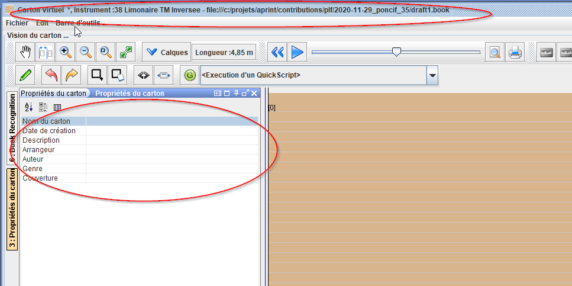

# Informations sur le carton

Le format VirtualBook (.book) permet la définition de métadonnées, documentant l'origine du carton, et plusieures informations associées

Ces informations peuvent être définies dans la fenetre carton.

Ces renseignements informent sur le titre du carton (indépendemment du nom du fichier), la date de création, ainsi que l'auteur, et éventuellement une couverture

Ces informations sont sauvegardée dans le fichier en lui même, avec le contenu du carton et la description de la gamme du carton.

## Utilisation de ces informations

Ces informations de carton sont utilisée dans le moteur de recherche, permettant une recherche rapide d'un morceau. 

Ces éléments peuvent également être mis en place par script.

