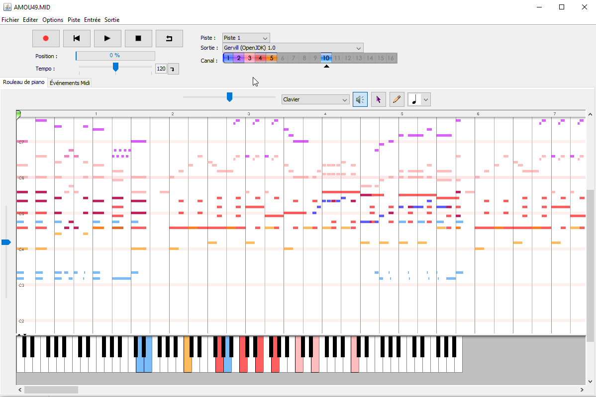
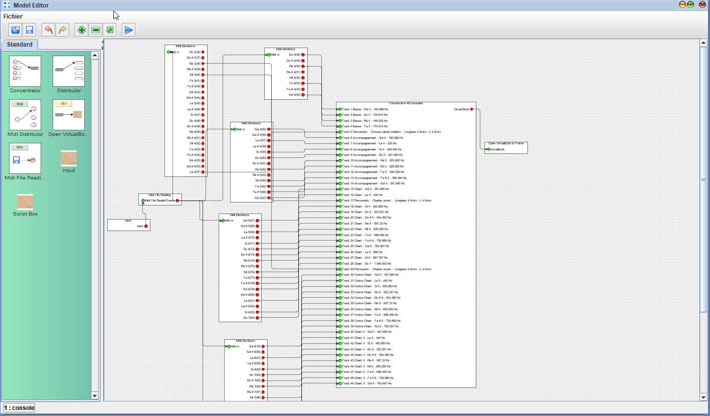
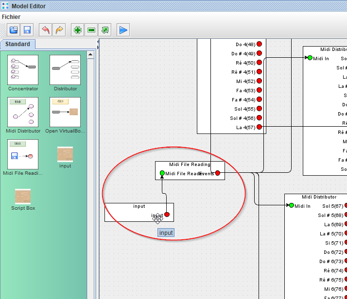
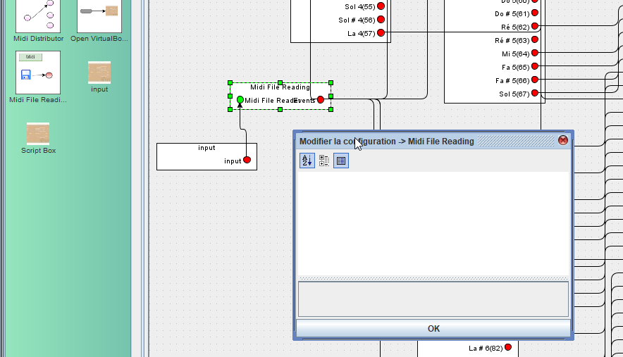
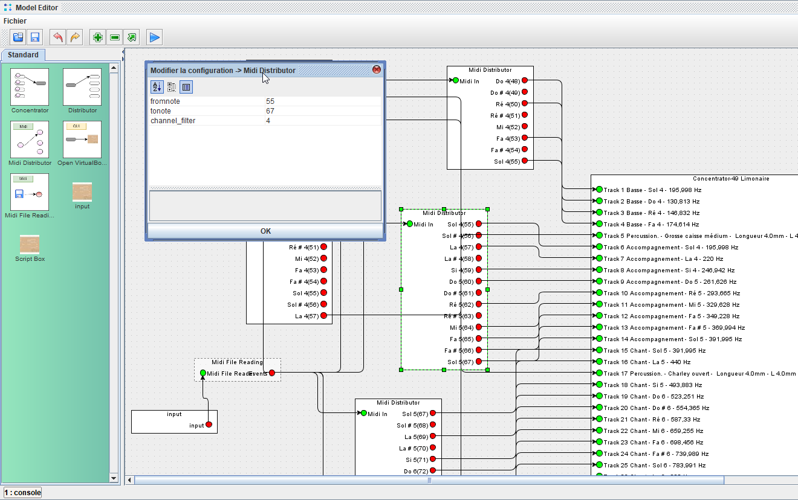
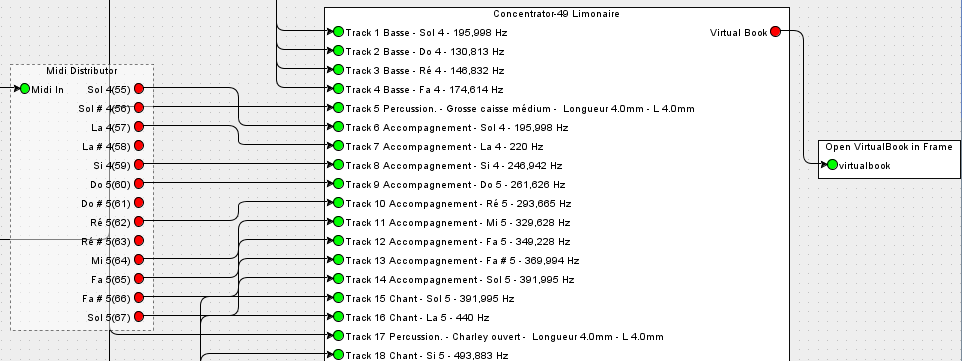
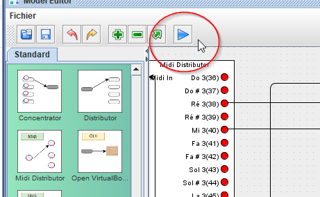
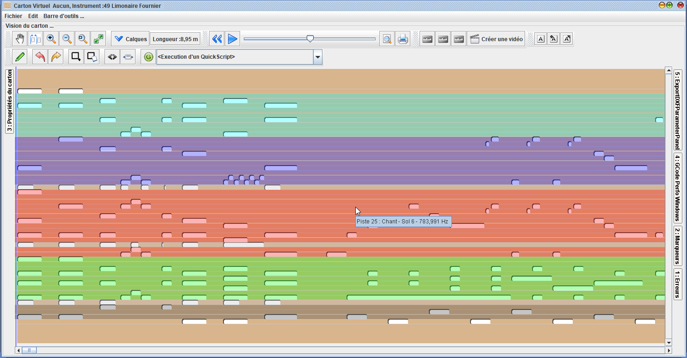

# Mise en pratique du Model Editor pour un arrangeur

Patrice Freydiere - Decembre 2020

Certains instruments, notamment les instruments de foire, comportent de multiples jeux de registres pouvant avoir plusieurs notes identiques en midi. 

Se pose alors la question, lorsque l'on arrange le fichier Midi dans son logiciel séquenceur, sur l'organisation de la notation. Doit on utiliser plusieurs canaux ? utilises t on les différentes pistes ?, Doit on monter à une octave au dessus le chant ?

Indépendamment de l'outil utilisé pour la création musicale Midi, **Model Editor** vous permet de faire rentrer votre composition Midi dans le format du carton, pour écoute ou perçage.

Le cas présenté est une réalisation de **Jérôme Collomb**, arrangeur à son temps libre, sur instrument de foire limonaires et orgues de rue.

## Organisation de l'arrangement dans les outils Midi

L'arrangement est réalisé par Jérome en utilisant différents Canaux MIDI pour :

- les percussions, 
- l'accompagnement
- le chant et contre chant

Une image ci dessous, montre l'organisation d'un fichier Midi arrangé pour le 49 Limonaire.

Le canal "10" est utilisé pour les percussions, les autres canaux sont utilisés ici pour les différentes sections de registre

## Utilisation du model editor pour définir le carton

Ainsi, pour "envoyer" les différentes notes correctement sur le carton, sans perdre la notation, Model Editor est utilisé.

le chargement du fichier midi est réalisé par deux boites initiales, permettant de charger le fichier midi et extraire les évènements.

Le fichier Midi est lu dans la boite "input"

Les boites "input" permettent de définir une valeur, pouvant être utilisé. Dans le cas ci dessus, c'est un fichier qui est lu pour permettre d'en décoder les évènements.

La lecture du fichier est alors réalisée avec le processeur 'Midi File Reading'. Celui ci lit le contenu du fichier midi et en extrait les différents évènements. 

le port de sortie de la boite contient alors une collection d'évènement midi, qui pourra être filtré pour envoi vers le carton.

Pour séparer du fichier midi, chaque canal et l'associer correctement aux différentes sections du carton, le processeur **Midi Distributor** est utilisé, au nombre de 4, celui ci va prendre en entrée les évènements midi et va filtrer les canaux important, pour ressortir : les percussions, les basses, l'accompagnement, le chant / contre chant. Comme ci dessous pour l'accompagnement :

Les paramètres fromnote, tonote, permettent de limiter l'affichage du Midi Distributor, en fonction du code MIDI. (Pour plus d'information sur les valeures des notes midi, [vous pouvez consulter cet article de wikipedia](https://fr.wikipedia.org/wiki/Musical_Instrument_Digital_Interface) ). APrint, Après validation de la boite, affiche les notes avec leur correspondance midi code. Ceci simplifie la compréhension.

Dans le cas de cette organisation, en canaux, le paramètre **channel_filter** est spécifié pour indiquer quel **INDEX DE CANAL** nous retenons dans le filtrage des évènements de type note du fichier **MIDI**

**ATTENTION, Nota**: L'index de canal paramétré dans le **Model Editor** débute à "0", et correspond à l'encodage dans le fichier midi. Nombre de logiciels de création de musiques travaillent et affichent le Numero du canal, (qui correspond à l'index incrémenté de 1). Veillez donc à faire quelques tests pour vérifier ce paramétrage, en fonction de votre logiciel de création musical.

## Envoi des notes dans la gamme du carton

Le décodage midi, filtre et offre une répartition des notes, pouvant être connectée sur le processeur "Concentratror", paramétré par la gamme du 49 Limonaire.

La connexion des notes du Midi Distributor, peut être réalisé dans les pistes souhaitées de la gamme de l'instrument.

## Construction du Carton

Les Pistes du carton étant alimentée, un objet "Carton Virtuel" est créé en sortie et peut être affiché dans une fenêtre.

## Execution du modèle

L'éxécution du modèle est réalisé par le bouton "execute" qui lancera la transformation.

 

L'affichage du résultat est alors réalisé dans une nouvelle fenetre. 

# Conclusion

Nous avons vu comment utiliser le modèle editor pour faire une passerelle précise, sans pertes, entre la notation dans un fichier de création musical et le passage en carton.

Cette opération n'a demandé aucunes compétences de développement et peut être adaptée pour l'ensemble des gammes et des instruments disponibles.

