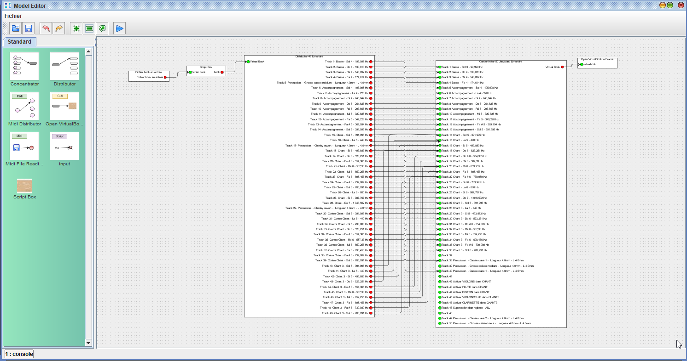

# Model editor

Le modèle editor est un outil de programmation visuel, permettant d'effectuer des transformations sur des cartons, des fichiers midi, ou automatiser certaines actions.

Son utilisation limite l'implémentation de script, ou de code et de pouvoir effectuer les taches suivantes :

- Chargement d'un fichier midi, et correspondance des évènements sur le carton
- Passer un carton d'instrument vers une autre gamme
- Faire des décalages pour les percussions, ou autres modifications

