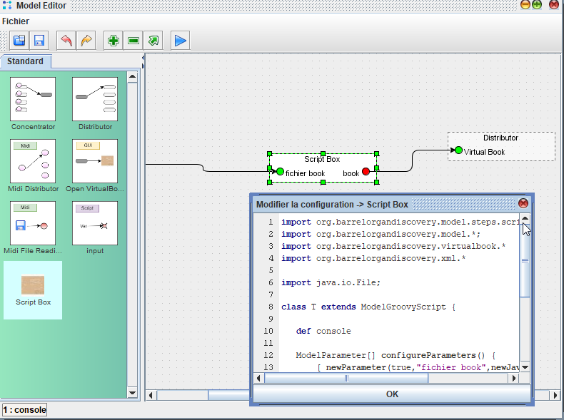
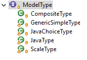

# Ecrire son processeur script

*Patrice Freydiere - 2018*

Dans le cas où un bloc manque dans la panoplie de ceux existants, Il est possible d'en définir de nouveau avec un script.

Cette extensibilité nécessite des compétences de programmation en language Java / Groovy.  


## Premiers pas avec le processeur Script


Situé dans la palette, un glissé / déposé, permet l'ajout du script dans le modèle. Un double click permet de définir le script associé.




Le processeur script, est une classe groovy, dérivant de ModelGroovyScript. Cette dérivation permet la prise en charge de la classe par le proceseur de scripts. Dans cette classe, deux méthodes sont à définir / ou surcharger. La méthode **configureParameters** impose de retourner la liste des paramètres qui seront exposés par le processeur. La liste des paramètres est retournée dans un tableau de **ModelParameter**. 

Une seconde méthode pour définir la logique éxécutée lors de l'éxécution du processeur : `Map execute(Map m)` . Cette méthode prends la liste des paramètres passés et retourne les paramètres de sortie.


Ci dessous un exemple de programme définissant un processeur :


```
import org.barrelorgandiscovery.model.steps.scripts.*;
import org.barrelorgandiscovery.model.*;
import org.barrelorgandiscovery.virtualbook.*
import org.barrelorgandiscovery.xml.*

import java.io.File;

class T extends ModelGroovyScript {
   
   def console
   
   // cette fonction est appeleé par le model editor
   // pour connaitre les paramètres et leur type
   ModelParameter[] configureParameters() {
       [ newParameter(true,"fichier book",newJavaType(File.class)), 
         newParameter(false,"book",newJavaType(VirtualBook.class))]
   }

   Map execute(Map m) {
       // m contient les valeures des paramètres passés au processeur
       console.println("hello :")
       console.println(m)
       // on retourne le paramètre "book" contenant un objet Virtualbook
       return [book:VirtualBookXmlIO.read(m["fichier book"]).virtualBook]
   }

}
new T(console:out) // le script retourne une instanciation de la classe
```


L'exemple ci dessus montre comment lire un fichier .book en utilisant les fonctions d'APrint Studio. (en utilisant la fonction *VirtualBookXmlIO.read* )

## Implémentation

Le script doit retourner en sortie (dernière ligne), une instance de classe **ModelGroovyScript**,  cette instance sera prise en charge par le processeur et appelée.

 

deux méthodes sont à implémenter :

- **configureParameters** : cette fonction retourne la liste des paramètres qui sont configurés en entrée et en sortie
- **execute** : cette fonction est appelée lors de l'execution du processeur


## configureParameters

Cette méthode retourne la liste des paramètres d'entrées et de sortie. Pour la définition des paramètres d'entrée et de sortie, la méthode **newParameter** (boolean isIn, String name, ModelType type)  propose d'aider à la création du paramètre.

**isIn** : le premier paramètre indique le type de paramètre (entrée ou sortie), si à true, le paramètre spécifie un paramètre d'entrée. 

**name**: le second spécifie l'identifiant utilisé dans les hashmap passées en paramètres de la méthode execute ou dans le retour de la fonction (retour de la fonction).

**type**:  type de paramètres. ce paramètre défini le type de paramètre (information de typage), et propose à l'utilisateur une saisie associée, ainsi que de valider les types de connexion possibles avec les autres boites. l'objet paramétré doit être du type *ModelType*



deux fonctions proposées par la classe de base, permettent de simplifier l'utilisation :

**newJavaType**, et  **newHolesType** le système de typage est précisé dans les articles liés à l'implémentation des processeurs.


### execute

La fonction execute est déclenchée lors de l'execution du processeur. Celle ci implémente la fonctionnalité en fournissant les valeurs des paramètres d'entrée dans une table de hashage et retourne le résultat sous cette même forme.

Les identifiants des paramètres sont utilisés pour associer les valeurs aux paramètres d'entrée et de sortie.  


### Log

La classe de processeur implémentée peut déclarer un objet console, pour effectuer des logs de déboggage, permettant la mise au point. La fonction **println** est utilisée pour envoyer des valeur à la console de déboggage. 

