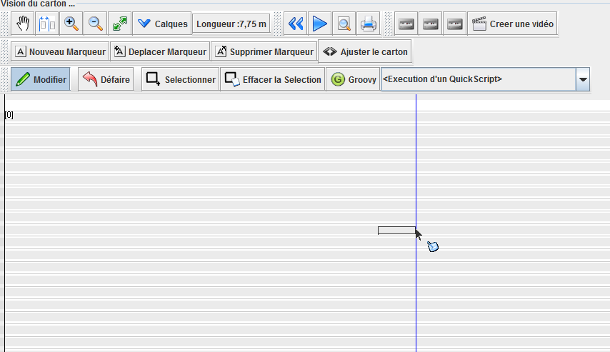
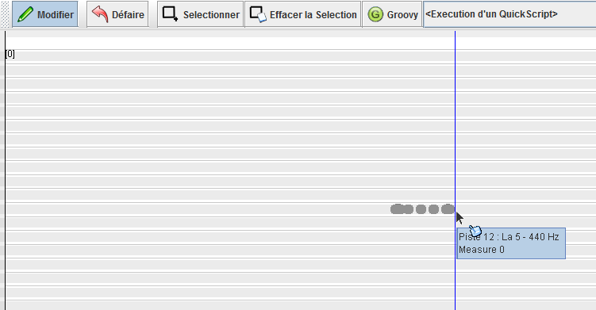
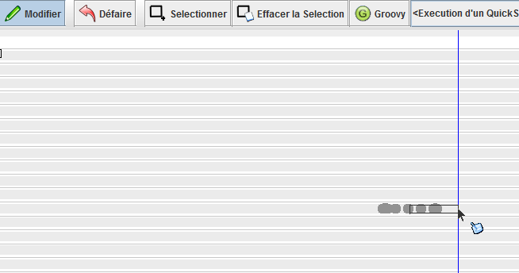
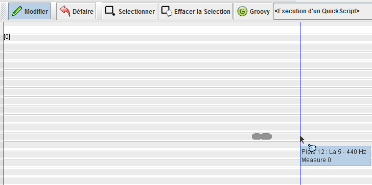

# Utiliser les outils de modification du carton

La fenêtre du carton, propose une série d'outils pour modifier ou ajuster le carton.

La barre d'outil d'édition, pour des modification unitaires. 

Des quickscripts, permettant d'effectuer des routines de modifications du carton.

## Utilisation de l'outil de modification unitaire

L'outil modifier  permet de créer ou supprimer des trous en faisant un glissé déposé sur le carton avec le bouton gauche de la souris.

une fois le glissé réalisé, le trou est créé :

pour supprimer un trou, l'opération est la même avec le bouton droit de la souris

Les pistes ont certaines significations, (Basses, Accompagnement, Chant) une info bulle informe en permanence du rôle de la piste.

## Attirance magnétique

Lors des opération de modification de trous, il est possible de s'aligner sur les trous environnement. Lorsque la touche "Majuscule" est appuyée, le curseur se magnétise et se cale sur le début des trous situés sur les même timing.

Ceci permet de garantir l'alignement des trous sur un même temps.