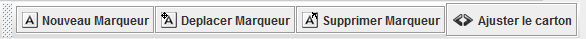
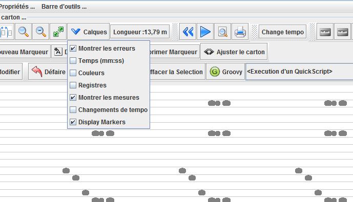
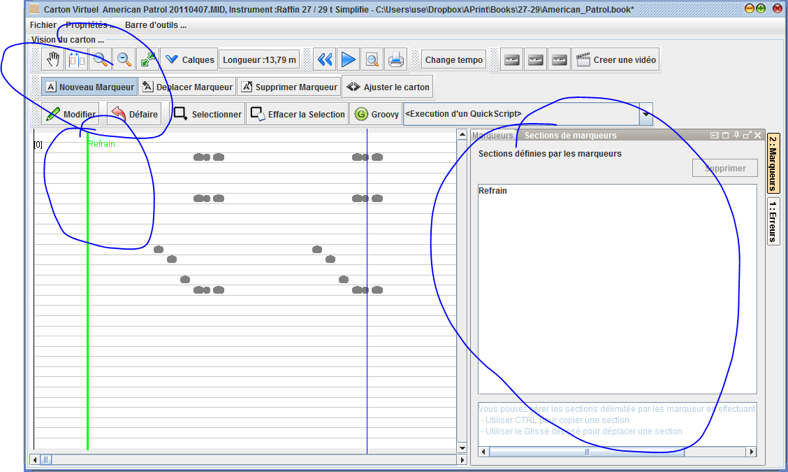
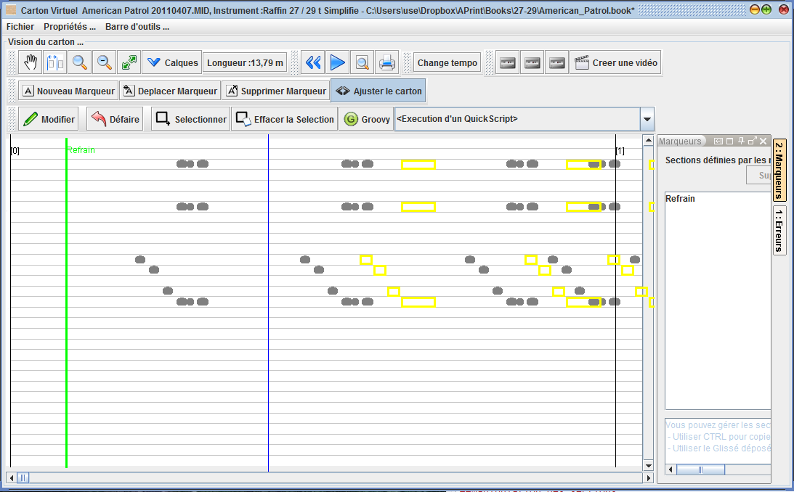
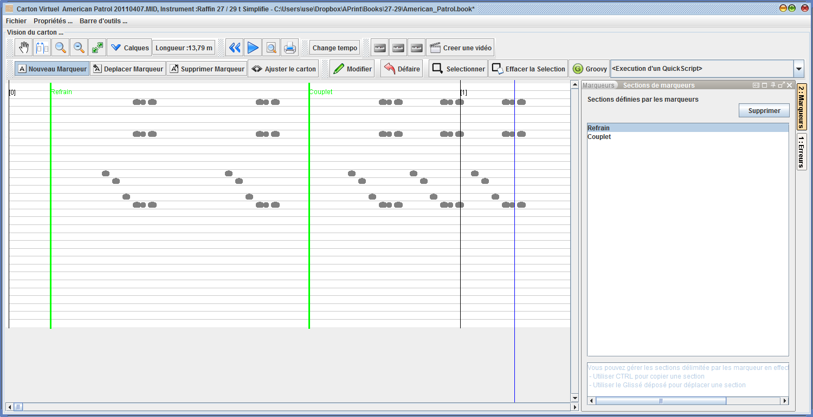

# Fonctionnalités de montage de cartons

_Disponible à partir de la version 2014 Q4_

Il est fréquent de récupérer des fichiers midi, ou des numérisation ne contenant que des parties de fichiers midi, organisées en "Refrain" + "Couplet" etc ... , et que l'on doivent mettre bout à bout ces éléments pour reconstituer le carton final.

Ces fonctions de montage de carton peuvent être utilisées pour effectuer ces modifications, mais peuvent être utilisées également en édition pour modifier, ou raccourcir ou étendre un carton avec des refrains ou des morceaux de musique supplémentaires.

## Marquer des début de section

une nouvelle barre d'outil affichable dans la vue carton permet de travailler avec ces nouveaux outils.

ces outils travaillent avec un calque de "marqueurs", permettant l'affichage.

## Créer une marque

La création d'une marque est réalisée avec l'outil "Nouveau marqueur", en clickant cet outil et en sélectionnant un endroit sur le carton, il est possible de créer une marque de sébut de section.

le marqueur apparait dans une fenetre située sur la droite, donnant une vision des différentes marques posées.

## Modifier la position d'une marque

l'outil **"Déplacer marqueur"** permet de réajuster le marqueur si celui ci a été mal placé et doit être avancé ou reculé.

## Supprimer une marque

L'outil **"Supprimer marqueur"** permet d'effacer la marque, en le sélectionnant sur le carton.

## Ajuster le carton

Il est parfois intéressant de pouvoir avancer ou reculer des trous sur le carton. L'outil **Ajuster le carton** permet par un glissé déposé sur le carton d'avancer ou de reculer TOUS LES TROUS SITUES après le click souris.

## Manipulation des sections

**Chaque marqueur défini un debut de section** depuis sa position et juqu'à la marque suivante, ou la fin du fichier.

Une fenetre située sur la droite de la fenetre d'édition donne la possibilité à l'utilisateur de travailler les sections marquées.

Il est possible alors de dupliquer une section, déplacer une section ou supprimer une section.

Ces actions sont réalisée en sélectionant la section dans la fenetre, puis en effectuant un glissé déposé. **Les actions sont modifiées par la touche CTRL** qui propose la duplication en lieu et place du déplacement.

Entrainez vous sur ces actions, si une action n'a pas l'effet escompté, vous pouvez annuler en utilisant le bouton "Défaire".

