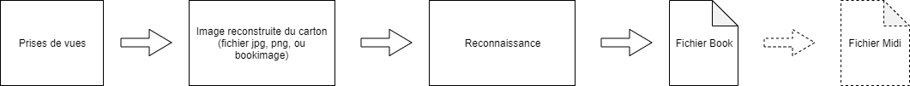

# Numériser un carton

Un carton, Disque, rouleau de papier peuvent être numérisés et transformé en Book ou fichier midi.

La numérisation pour l'utilisation, la modification, la reperforation, est découpée en deux phases: 

- une phase de construction d'une image complète du carton à partir de toutes les prises de vues.
- puis reconnaissance de l'image pour créer un fichier book ou midi

Plusieures méthodes de numérisation sont possibles directement avec le logiciel

## Numerisation en utilisant un lecteur physique MIDI, 

Cette méthode utilise un matériel de numérisation, tel que proposé par [Christian Blanchard](https://orgautomatix.blog4ever.com/) ou d'autres fabricants dans le monde. 

Ces matériels enregistrent dans un fichier Midi ou un fichier Texte les timings et la présence des notes. 
Dans le cas de fichier Midi, le module Model Editor est tout indiqué pour lire le fichier Midi et effectuer la correspondance avec la gamme de l'instrument.

Le modèle Editor permet également de pouvoir traiter le cas de fichier autres (en utilisant le processeur script, la lecture du fichier d'entrée peut être réalisé), les notes sont ensuite également transférables sur le carton.

## Numérisation en utilisant des photos ou des videos 

La numérisation est effectuée à partir de prise de vue image du carton. Plusieures possibilités directement avec le logiciel  :

1 - utilisation d'une webcam, avec une prise de vue régulière (chaque X secondes)

2 - utilisation d'une webcam et d'une machine spéciale utilisant GRBL (lazer ou punch), aprint pilote alors l'avancement du carton

3 - utilisation d'un fichier video, réalisé avec un téléphone ou autre méthode d'acquisition

