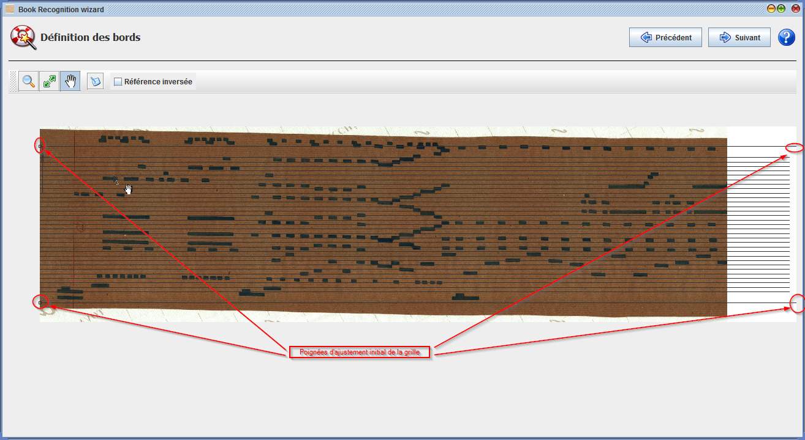
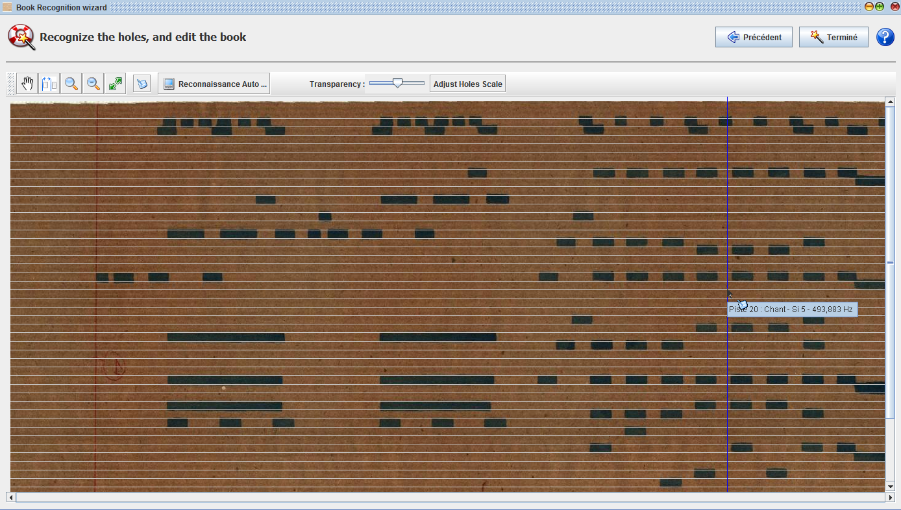
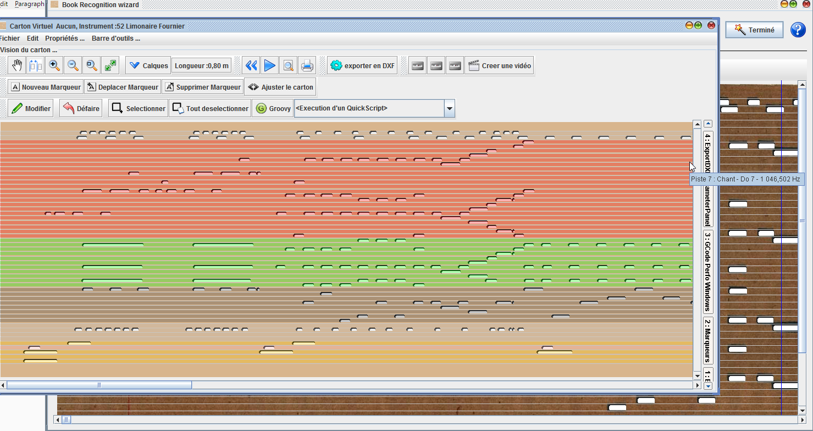

# Reconnaissance de cartons

Patrice Freydiere - 2017

Cette fonctionnalité, accessible depuis le menu principal, permet la transformation d'une image numérisée en fichier book, exportable en MIDI.

3 étapes sont nécessaires pour la conversion de l'image en fichier midi ou book :

1 - Choix du modèle de reconnaissance

2 - Définition des bords du carton

3 - Reconnaissance, ajustement du tempo et corrections manuelles

## Numerisation du carton

Cette fonctionnalité repose sur une image du carton. Cette image doit être créée au préalable par un scanner ou une camera, en utilisant un logiciel de reconstruction d'image (@@@ references).

Dans nos essai, un scanner à main de ce type a été utilisé, d'autres sources d'image ont été également testée

Le carton peut être long (plusieurs mètres), le processus présenté ci dessous peut être répété plusieurs fois, l'assemblage final pouvant être réalisé avec les fonctions de copier / coller.

### Résolution de numérisation

La reconnaissance est réalisée en couleur, il n'est donc pas nécessaire d'avoir une précision importante. Dans les essais conduits, pour les instruments courants (27-29 touche,  orgues de foire), 200 dpi sont suffisants, avec une hauteurs de 800 pixels. Dans le cas où l'image est beaucoup plus importante, le logiciel proposera la création d'une image moins précise et suffisante, pour accélérer les traitements

### Conditions de numérisation

Les trous sont reconnus par différents modèles mathématiques. Ces modèles sont mis en place pour prendre en charge les cas rencontrés. (Ces modèles peuvent être enrichis au besoin). 

Les meilleurs resultat sont obtenus en ayant un assez bon contraste entre les trous et le carton, même si les algorithmes s'adaptent à des contrastes moins élevés.

## 1 ère étape : l'ouverture de l'image et choix de l'instrument

Dans la première étape, on sélectionne l'image à transformer. Ainsi que l'instrument associé au carton (gamme equivalente)

Lorsque l'image est sélectionnée, celle ci est affichée.

L'image doit être horizonale pour pouvoir être utilisée dans cette fonction, si ce n'est pas le cas, il faudra prendre un logiciel de dessin pour réaliser cette action.

Lorsque l'instrument est sélectionné, il est possible de passer à l'étape suivante.

## Définition du modèle de reconnaissance

L'étape 2 propose le choix du modèle mathématique de reconnaissance, plusieurs types sont proposés. Le choix du type de modèle déclenche le calcul de traitement d'image. Ce traitement peut être relativement long (fonction de la taille de l'image et de la complexité du modèle mathématique). Une jauge indique la progression du calcul. 

Pendant le calcul, le resultat apparait par parties, permettant de vérifier la bonne validité du choix du modèle. Il est possible de changer si besoin. 

Le passage à l'étape suivante ne pourra être réalisé qu'à la fin du traitement de l'ensemble de l'image.

Une jauge de transparence permet de visualiser l'image traitée par rapport à l'image d'origine. 

Un critère de bonne reconnaissance est le recouvrement en noir des zones de trous, dans le cas ou ces zones sont disparates, le modèle n'est peut être pas compatible. Il est alors intéressant d'en sélectionner un autre.

Les outils de visualisation permettent de se déplacer sur l'images, de pouvoir observer le resultat.

## Définition des bords du carton

Après la phase de traitement d'image, il est nécessaire de caler la grille de la gamme, pour assurer une bonne reconnaissance des notes.

Cette étape est la plus délicat (bien que simple), et définit grandement la qualité du resultat

à l'initial, 4 poignées sont disponibles pour recaler la gamme sur le carton. L'outil d'ajustement permet de modifier leur position 

Par glissé déplacé, sur les poignées, il est possible d'avoir une première approximation de la position de la gamme sur le poncif. Comme ci dessous

**Note sur l'orientation du carton**

il est possible que la gamme soit inversée par rapport au carton (soit par une numérisation à l'envers, soit par définition de gamme dont la référence est en bas). 

La référence de la gamme est indiquée sur l'écran par une flèche, comme ci dessous :

Pour inverser la position de la gamme, il est possible d'inverser cette référence. 

La première approximation, peut ne pas coller à certains endroits du carton (probleme de numérisation, ou déformation du carton). Comme ci dessous :

Il est alors possible de créer des poignées supplémentaires, localement avec l'outil d'ajustement en s'approchant de la ligne du bord. Le logiciel propose alors la création d'une nouvelle poignée par clické - glissé.

Lorsque l'outil d'ajustement est sélectionné, il est possible de supprimer une poignée en s'approchant de celle ci (elle se colorie en bleu), puis en appuyant sur la touche du clavier "DEL" ou "Suppr".

Ceci permet au mieux de faire coller la gamme à l'image du carton.

Lorsque le travail est terminé, il est possible de passer à l'étape suivante de l'assistant.

ajustement terminé.

## Conversion en Musique et corrections manuelles

L'étape suivante montre le carton "redressé" sur la gamme, 

Les trous sont maintenant bien alignés et peuvent être lus en utilisant le bouton **"Reconnaissance Auto ..."**

La vitesse peut avoir été mal interprétés car définie par une évaluation de la largeur du carton. Il est possible de corriger cela avec l'outil "Adjust Hole Scale". En réalisant un glissé sur le carton, il est possible de faire supperposer l'image et les trous.

Le carton est ci dessus ajusté en vitesse.

Dans cette étape, l'outil d'édition manuel permet avec des glissé déplacé, de corriger unitairement les problemes restant sur la reconnaissance.

La reconnaissance est maintenant terminée, la terminaison de l'assistant créer une fenêtre finale, permettant l'écoute, l'assemblage ou l'export Midi.

