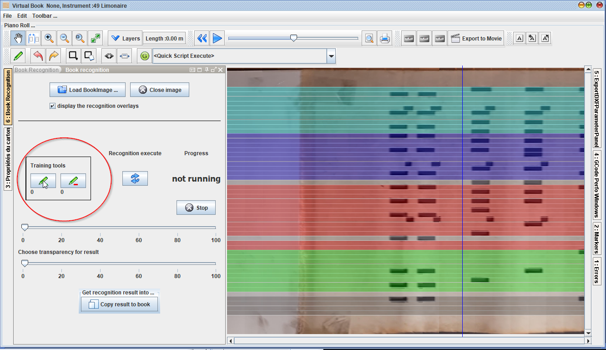

# Extension de reconnaissance de fichier bookimage

Depuis la version APrint 2020 Q2, une nouvelle fenetre d'extension est mise en place pour effectuer de la reconnaissance de carton, avec apprentissage.

Pour l'utiliser, vous devez avoir créé au préalable un fichier .bookimage, contenant l'image du carton. Référez vous alors à la rubrique de numérisation.

## Chargement du fichier BookImage

Créer un nouveau carton, avec la gamme de l'instrument 

Selectionnez le bouton de chargement du fichier book image, et sélectionnez le fichier

Le carton apparait dans la zone carton. en utilisant l'outil main (déplacement), vous pouvez voir l'image mise en sous impression dans la zone carton.

## Spécifiez la reconnaissance

en utilisant les outils d'apprentissage, vous pouvez indiquer à aprint les zones contenant du carton, et les zones contenant des trous.

une fois que des zones carton et trous sont définies,déclenchez le traitement avec le bouton.

 

Le traitement peut prendre un peu de temps, un ordinateur puissant est nécessaire pour faire le travail. 

Quelques instant après, le processus de reconnaissance est affiché en bleu sur le carton. Il indique les trous reconnus sur l'image.

En fonction de la prise de vue, et des jeux d'apprentissages donnés, le resultat n'est pas forcement optimum, cependant il est possible de continuer à lui définir les zones de trous et de carton, en fonction des erreurs commises.

en général une ou deux itérations suffisent pour avoir un resultat très intéressant.

## Récupérez le resultat de la reconnaissance

Le resultat étant jugé satisfaisant, la reconnaissance peut être récupérée dans le carton, en utilisant le bouton en bas de la fenêtre

Il est alors possible de conserver l'image en fond et d'effectuer des retouches, en fonction du resultat de la reconnaissance.

