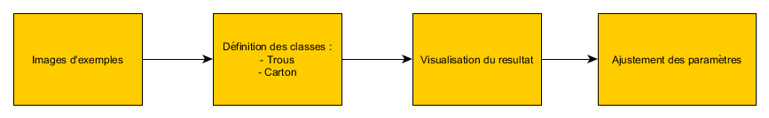
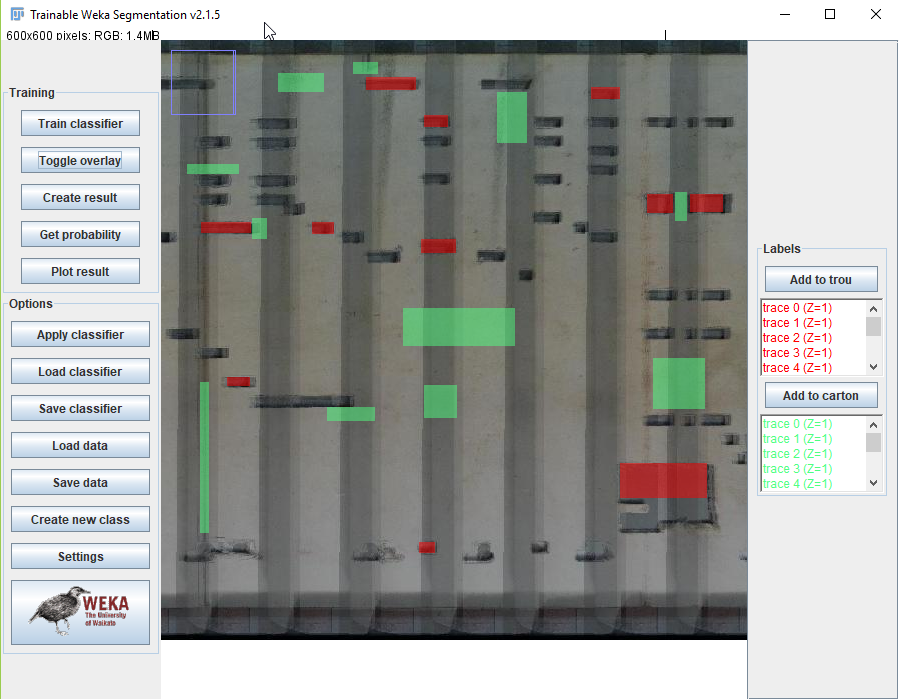
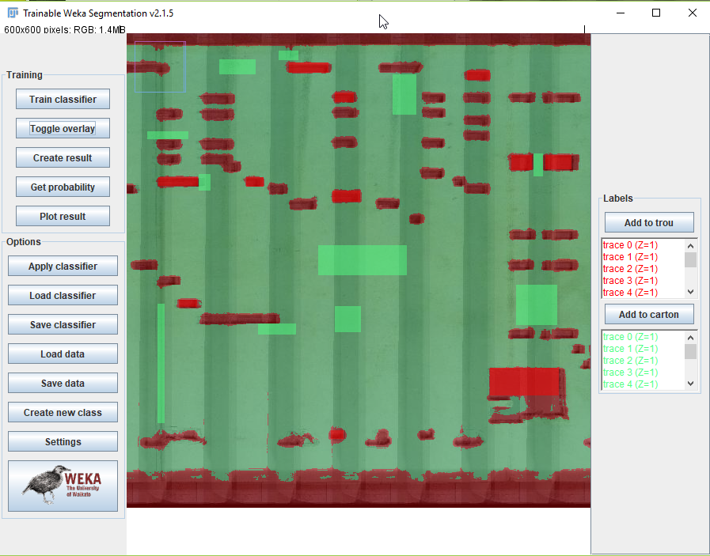
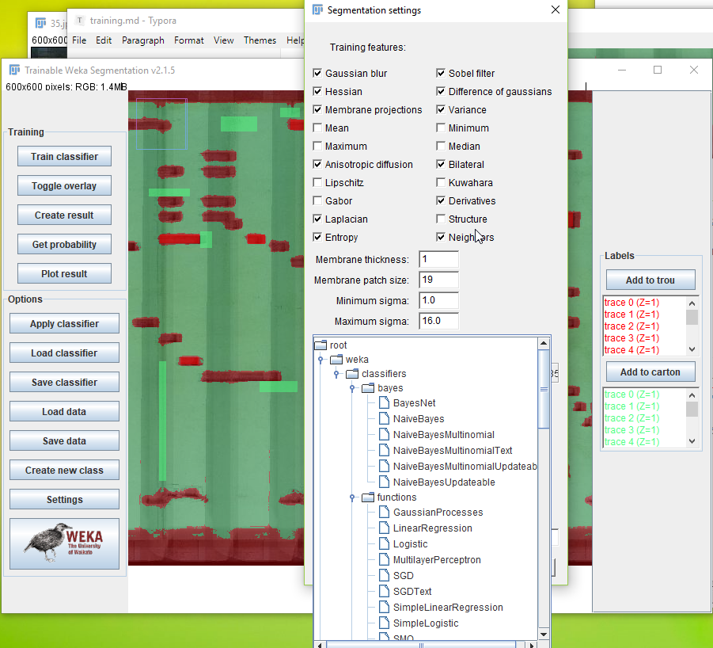
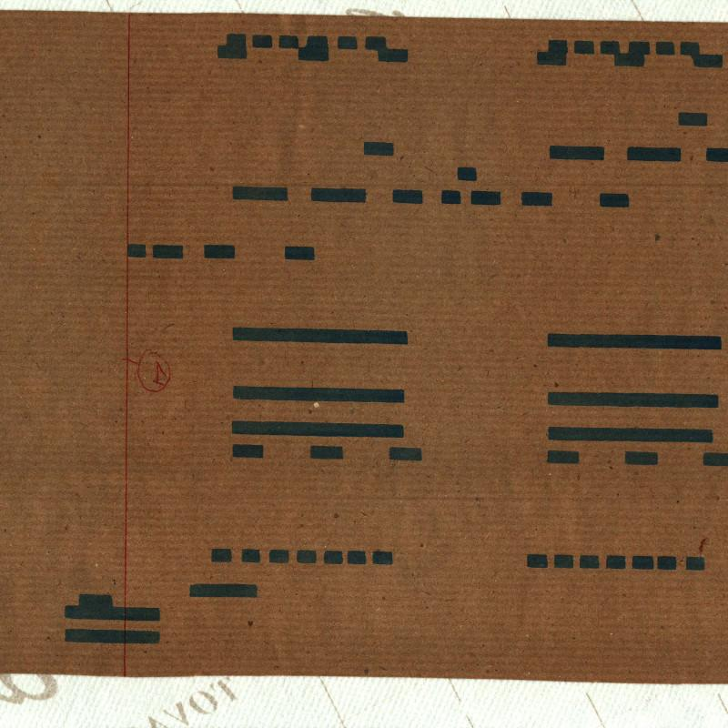
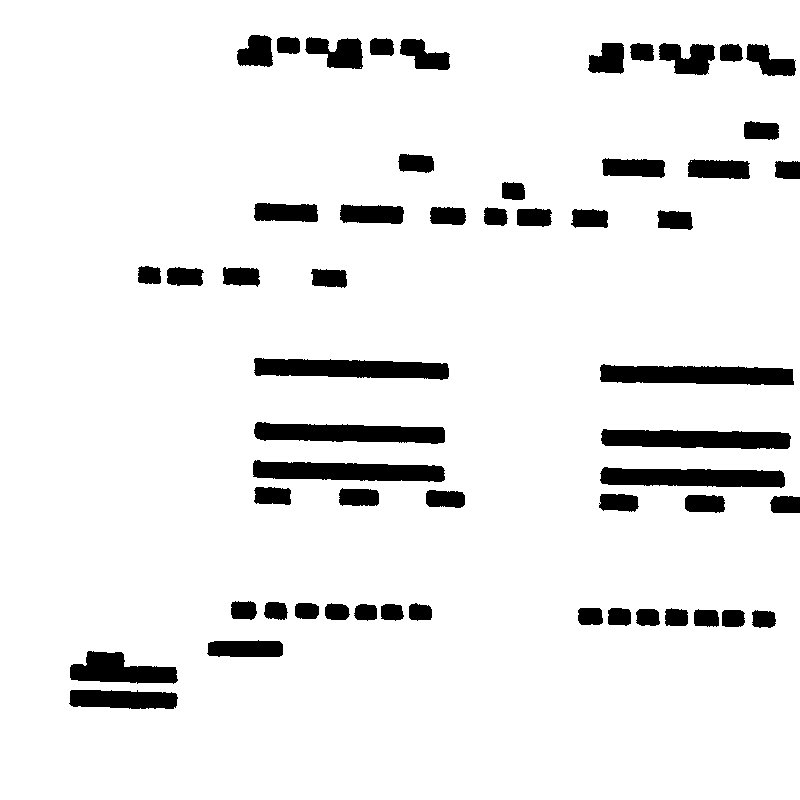
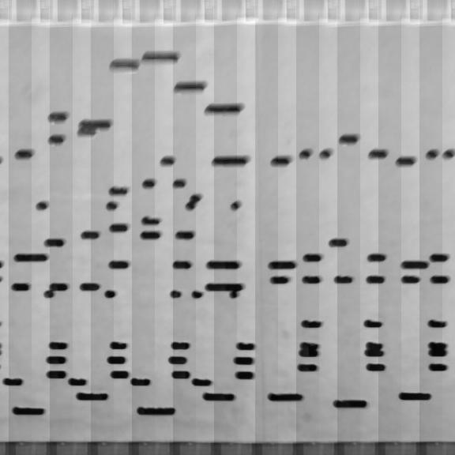
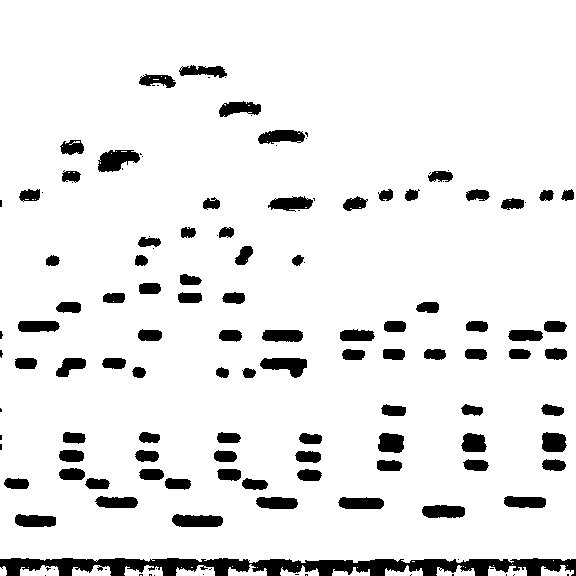

# Ameliorer la reconnaissance de cartons

*Patrice Freydiere - février 2019*

APrint Studio permet d'effectuer la reconnaissance de carton en utilisant des algorithmes d'intelligence artificiels. Ces algorithmes donnent de bonnes performances sur des jeux d'entrainement donnés. Cet article explique comment créer son propre modèle de reconnaissance pour s'adapter :

- Aux conditions de prises de vues (éclairage)
- Aux différents types de cartons (poncifs, cartons clairs, ou sombres).

La création d'un modèle est assez rapide, et peut nécessiter quelques essais. Une fois le modèle mis en place il est assez aisé d'améliorer SIGNIFICATIVEMENT la reconnaissance et limiter le nombre de retouches manuelles.

## Fonctionnement

Les algorithms apprennent en fonction de paramètres d'entrée (dans notre cas, une image).

On définit alors dans l'image ce qui "est" :

- un trou
- du carton

APrint Studio, utilise la large bibliothèque d'algorithmes de WEKA (projet de l'université de Waikiki)

exemple de définition des classes

La classe 1 défini sur l'image les "trous", dans Fiji, un outil permet de sélectionner des pixels et le bouton "Add to trou" permet de définir ces pixels comment faisant partie de la classe "trous"

une fois les classes définies, le bouton "Train Classifier", permet de déclencher l'apprentissage et de visualiser le resultat.

Il est alors possible de modifier les classes de nouveau et relancer l'apprentissage.

Le modèle une fois réalisé peut etre sauvegardé dans un fichier (save classifier), et réutilisé dans APrint Studio. 

## Paramètres de modèles

Même si le paramétrage par défaut (utilisation des "random forest") donne de très bons résultats, La performance du modèle dépend beaucoup des conditions d'image d'entrée.

Beaucoup d'algorithms sont disponibles et peuvent être utilisée pour tester les meilleurs résultats en fonction de conditions d'entrée :

Dans la partie supérieur, le plugin Segmentation Classifier Weka propose l'augmentation des paramètres d'entrée en utilisant différentes fonctions de traitement d'image. En effet, l'utilisation des filtrages de sobel (détection de contours) aide l'algorithme d'apprentissage pour la détection des trous.

## Retours d'expérience

Les paramètres par défaut fonctionnent bien, avec des couleurs définies. Dans le cas où l'on souhaite mettre en place une reconnaissance plus générale, il est possible de combiner des modèles et des données associées et construire un modèle plus complet.

Plus le modèle est complet (augmentation du nombre de paramètres, complexité du modèle ), plus le temps d'apprentissage et de reconnaissance est important !

Il n'est pas étonnant d'avoir quelques dizaines de minutes de calculs est une bonne moyenne. Dès lors que le calcul ne nécessite pas d'intervention humaines, ceci peut être fait en tache de fond.

exemple d'utilisation sur un PONCIF non percé :

le résultat, après modèle spécifique :

Autre exemple, sur une prise de vue continue (webcam) :

ci dessous, le carton n'étant pas bien guidé en partie supérieur, la superposition des images génère un floue dans la reconstruction finale. (Fonctionnalité APrint 2019)

