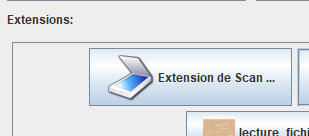
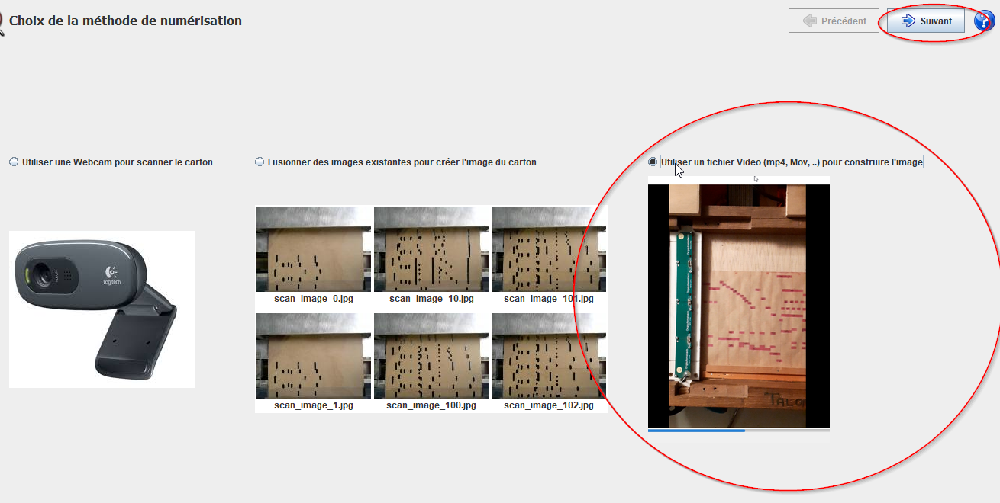
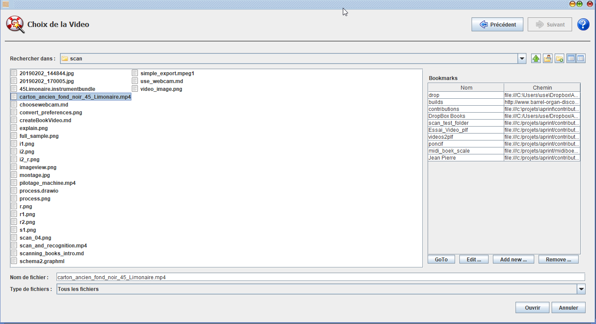

# Créer une image de carton à partir d'une video

Il est possible d'utiliser une video pour créer une images du carton, et permettre la supperposition avec l'espace de travail, cet article explique comment proceder.

Video: (ouvrir avec le clic droit, ouvrir la video dans un nouvel onglet)

<video src="../scan_and_recognition.mp4" width="600"></video>

## Passer de la video au carton

Dans l'extension Scan, il est possible depuis la version 2020 Q2, de récuperer des portions d'images à partir de video. Celle ci est disponible dans l'installeur, et doit avoir été installée. Dans ce cas, le bouton apparait sur la fenetre principale.

Le scan video est disponible sur la 3 eme étape, 

Sélectionner ensuite le fichier video, et appuyez sur Open / Suivant pour passer à l'étape suivante. 

Si vous souhaitez faire un essai de votre coté, ci dessous une video d'exemple , avec l'instrument associé (si vous ne l'avez pas déjà).

[Fichier video d'exemple, pour utilisation dans APrint Studio](../carton_ancien_fond_noir_45_Limonaire.mp4)

[Fichier instrument 45 Limonaire](../45Limonaire.instrumentbundle)

Le passage à l'étape suivante propose la saisie de la fenetre

Utilisation de la fenetre de scan (en video, clickez sur le bouton droite, et ouvrir la video dans un nouvel onglet).

<video src="../scan_video.mp4" width="600"></video>

Le fichier BookImage étant créé, vous pouvez passer à la nouvelle reconnaissance installée dans la vue carton.