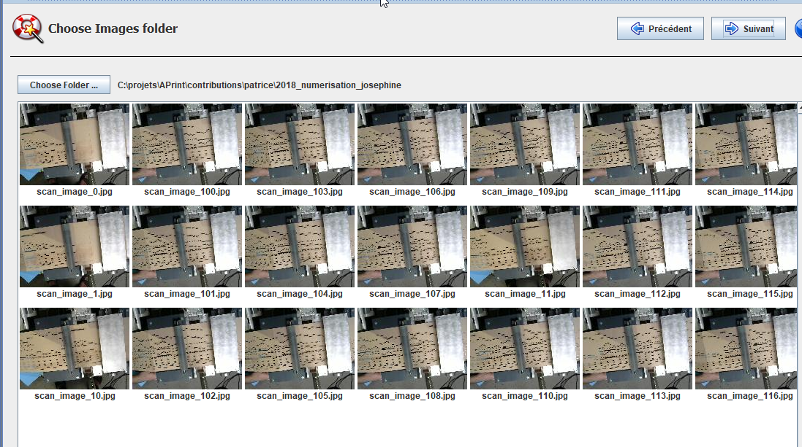
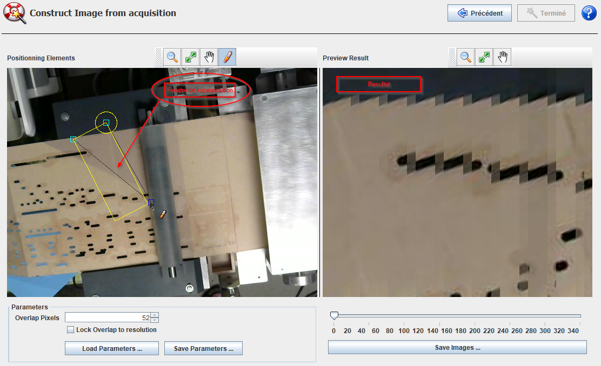
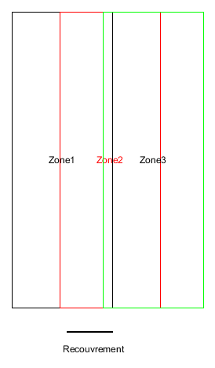
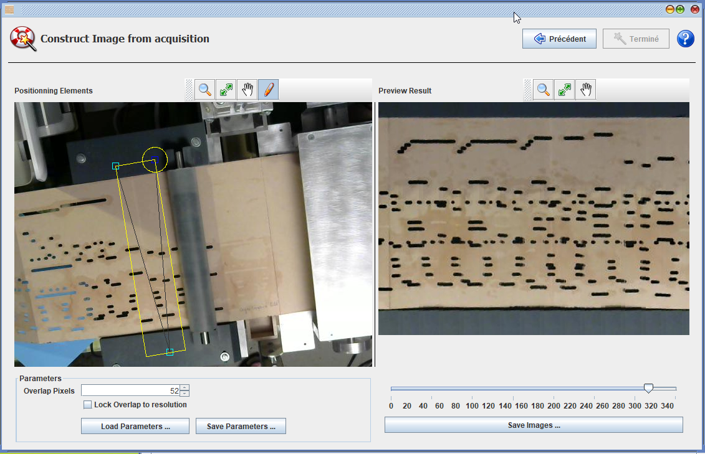

# Construire une image de carton, de poncif

*2019-02 Patrice Freydiere*

à Partir de 2019, APrint Studio propose des fonctionnalités pour scanner les cartons endommagés, ou des poncifs d'origine,  à partir de caméras USB. Des prises de vues périodiques peuvent également être utilisée pour la reconstruction de l'image finale.

L'avantage de ce mode de fonctionnement, est de permettre d'avoir une image complète de l'ensemble du carton, pour pouvoir l'archiver, ou revalider après coup la numérisation. Les erreurs peuvent se corriger directement in situs sur l'image du carton.

Ce procédé utilise un déplacement régulier et précis. Qui peut nécessité un petit montage pour positionner la caméra, et une avance régulière pour le carton.

Une prise de vue video peut également être envisagée, des outils comme VLC, permettent d'extraire de la video des prises de vues régulières.

## Comment ça marche ?

à partir de plusieurs images régulières, pris à intervalles réguliers ou en utilisant une base de temps fixe (sans variations de vitesse).

l'utilisateur sélectionne la fenetre de superposition et d'aquisition sur le carton :

La zone en jaune indique la portion de l'image à conserver, le paramètre "Overlap" spécifie la longueur du recouvrement sur l'image (décalage de chaque image)

En quelques clicks et réglages, le carton apparait sur la droite, une prévisualisation peut être réalisée sur l'ensemble du carton

Ce carton reconstruit peut être utilisé dans la reconnaissance.