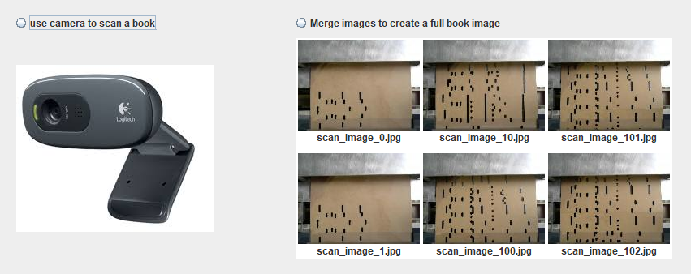
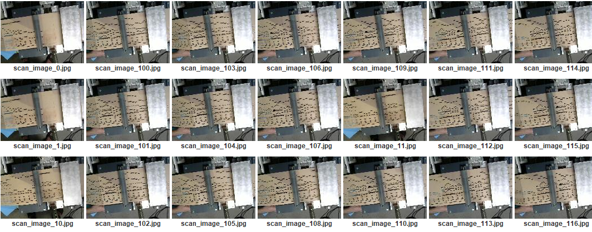
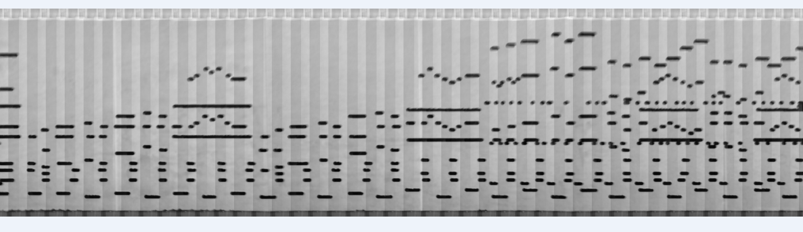
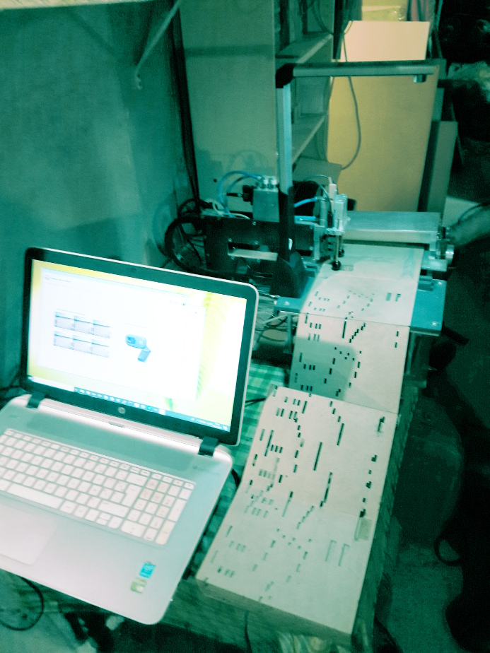

# Utiliser une WebCam pour numériser un carton

*2019 - Patrice Freydiere*

L'utilisation d'une web cam prenant des clichés régulier du carton, pour la numérisation,  est possible. En prenant une série d'images à intervalles régulier, il est possible de créer un ensemble d'image pouvant être reconstruits. 

ci dessous une image complète, une fois reconstruite du carton :

## Scan WebCam

La sélection du scan est réalisée à partir de l'extension de scan, permettant de numériser :

- en utilisant une machine 

- en utilisant une prise de vue régulières (basée sur le temps)

## Montage WebCam utilisé pour un scan

Pour l'aquision, il est possible de réutiliser un guidage de carton, ci dessous, l'exemple de montage utilisé sur une machine de perforation. La webcam est montée sur un trepied amovible, situé au dessus du chemin de carton.

## Utilisation du déclenchement par une machine GRBL

L'interface de numérisation permet l'utilisation de GRBL pour l'avancement automatique du carton entre les différentes prises de vues.

<video width="420" controls="true" muted="true">
   <source src="scan/pilotage_machine.mp4" type="video/mp4">
</video>

