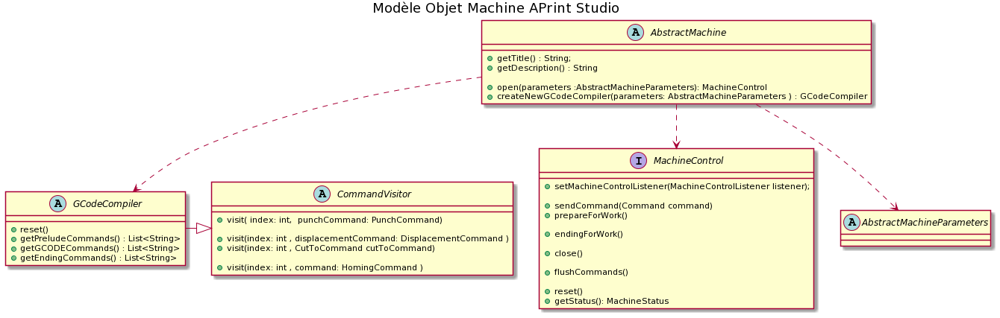

# Ajouter l'implémentation d'un nouveau support machine

APrint Studio propose dans son coeur, une implémentation de support machine flexible. Cette option , en développement JAVA, permet :

- Dans une 1er lieu une spécialisation du language GCODE pour l'export en fichier CNC machine pour la perforation laser ou krunch
- Dans un 2eme lieu un pilotage machine directe, pour bénéficier d'une reprise et gestion de la planification et perforation

Ces deux niveaux nécessite des connaissance en informatique, et autant le 1er niveau demande une connaissance limitée, pour le pilotage machine, le travail a effectuer est plus important nécessitant une expertise sur les trames de communication machine, et façon de piloter et envoyer les ordre CNC à la machine.

Cet article a été mis dans la partie perforation, cependant a également toute sa place dans la partie extension des fonctions en développement du logiciel.

## Le modèle objet machine

Chaque machine définissent 3 objets principaux :

- une machine, (dérivant de AbstractMachine)
- un objet de control machine (pour le pilotage)
- des paramètres (utilisés dans l'optimisation ou dans les préférences de perçage)
- un dialecte machine (basé sur des chaines de caractères)

Deux implémentations de ce modèle proposent une implémentation de base  pour perforation mécanique et perforation Laser.

Une implementation est proposée également sur le control utilisant le middleware GRBL (en version 0.9_punch pour la perforation et 1.1 pour la perforation lazer).

 

