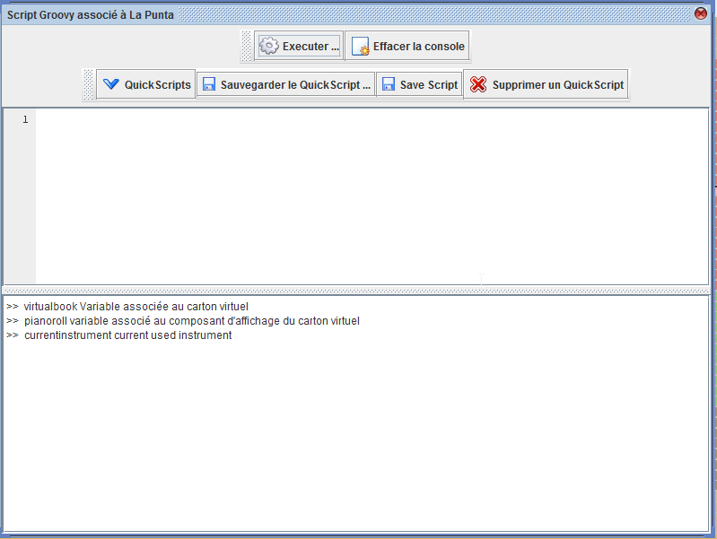

# Premiers pas avec les quickscripts et la manipulation de cartons


Les quickscripts permettent de manipuler le carton en automatique.



Nous allons voir ci dessous les éléments principaux de l'utilisation de cette console.

# virtualbook

La variable virtualbook contient le carton en cours de manipulation. on peut alors connaitre sur cet objet :

- La gamme (Scale)
- les trous (Hole)
- des évènements complémentaires (markers, mesures ..)


### Tutoriel 1 : lister les trous du carton

lister les trous d'un carton :  tapez virtualbook.getHolesCopy() dans la console, puis appuyez sur "Executer ..."

le résultat apparait dans la partie du bas.


la fonction appelée retourne une liste contenant tous les trous, les trous sont caractérisés par: 

- un no de piste dans le carton (de 0 au nombre de pistes) : **track**
- une date de début du trou (en microseconde depuis le début du carton ): **timestamp**
- une longueur de trou (en microseconde depuis le debut du trou) : **length**


<u>Commande :</u>

```groovy
def c = virtualbook.getHolesCopy()
print c[0] // on prends le premier
```


<u>Resultat :</u>

```
>> start script execution
 900000 Note 44 Longueur 100000 micro 

 Script executed in  0: 0: 43 
null
```


pour connaitre les proprietes du trou, vous pouvez utiliser la fonction "dump" :

<u>Commande :</u>

```groovy
def d = virtualbook.getHolesCopy()
d[0].dump()
```

<u>Resultat :</u>

```
>> start script execution
 900000 Note 44 Longueur 100000 micro 

 Script executed in  0: 0:105 
<org.barrelorgandiscovery.virtualbook.Hole@4983ae77 timestamp=900000 length=100000 piste=44>
```


propriétés :

\<org.barrelorgandiscovery.virtualbook.Hole@4983ae77 **timestamp**=900000 **length**=100000 **piste**=44>


Pour accéder aux propriétés il suffit de mentionner son nom.

<u>Commande :</u>

```groovy
def d = virtualbook.getHolesCopy()
def n = d[0]
println n.dump()

println n.piste
println n.timestamp
println n.length
```

<u>Resultat :</u>

```
>> start script execution
<org.barrelorgandiscovery.virtualbook.Hole@4983ae77 timestamp=900000 length=100000 piste=44>
44
900000
100000
 

 Script executed in  0: 0: 84 
null
```


### Tutoriel 2 : Ajouter / Modifier / Supprimer des trous

Dans cette section, nous allons modifier les trous d'un carton, en modifiant le debut, la longueur ou en changeant la piste :


Modifions le debut d'un trou

<u>Commande :</u> 

```groovy
import groovy.aprint.transform.*


use(HoleCategory) {

    def d = virtualbook.getHolesCopy()
    def n = d[0] // on prends un trou
    println n.dump() // on l'affiche
    
    def h = n.beginAt(0) // on met le debut à 0
    println h.dump() // on l'affiche
    
    virtualbook.removeHole(n) // on enleve le trou initial
    virtualbook.addHole(h) // on ajoute le nouveau trou modifié
    
}
```

<u>Resultat :</u>

```t
>> start script execution
<org.barrelorgandiscovery.virtualbook.Hole@4983ae77 timestamp=900000 length=100000 piste=44>
<org.barrelorgandiscovery.virtualbook.Hole@1353d7 timestamp=0 length=100000 piste=44>
 

 Script executed in  0: 0: 32 
null
```


### Aller plus loin

la documentation complete de cet objet est disponible ici : 

[Class org.barrelorgandiscovery.virtualbook.VirtualBook](../../javadoc/org/barrelorgandiscovery/virtualbook/VirtualBook.html)

