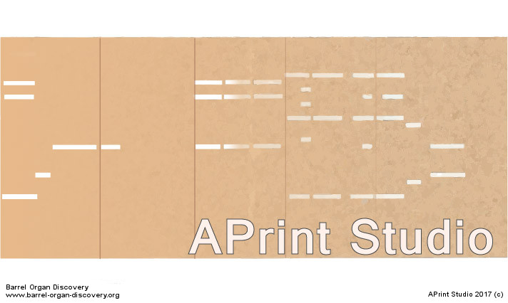
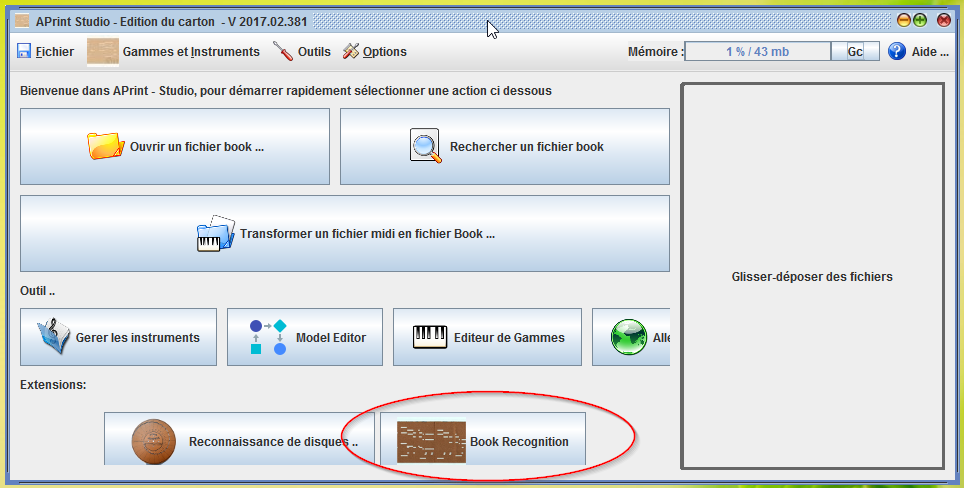
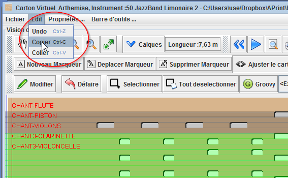
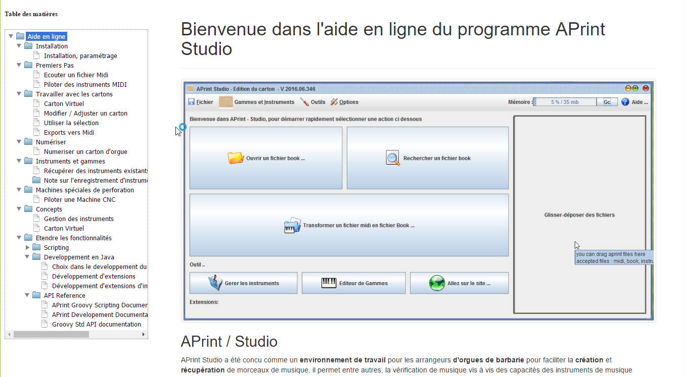
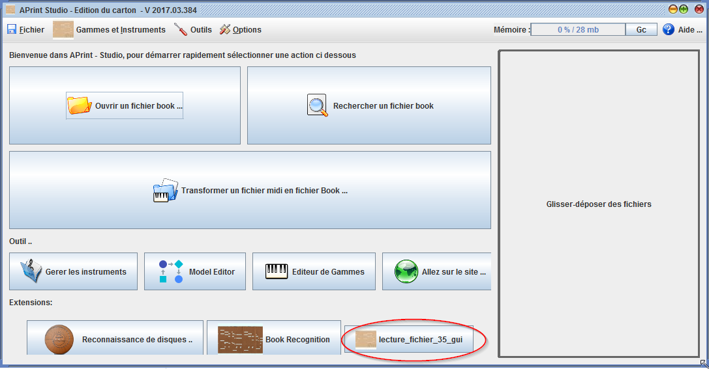
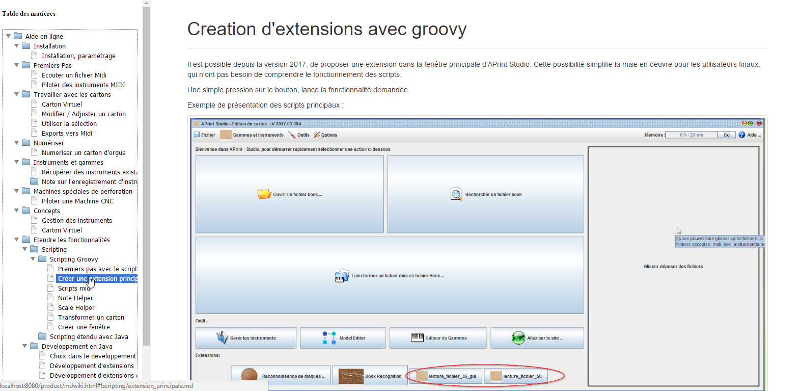

#APrint Studio - 2017

*Patrice Freydiere - Avril 2017*

##Introduction

Cette version majeure 2017 introduit les fonctionnalités et développements réalisés cette année 2016-2017 ainsi que des évolutions sur des développements initiés en 2016.

APrint Studio 2017 progresse sur la partie récupération de cartons d'origine, et manipulation de transformations sur les cartons. 

##Nouvelles fonctionnalités

### Reconnaissance de cartons d'orgues de barbarie

Cette extension **majeure** permet à un utilisateur équipé d'un scanner ou d'images numérisée d'un carton, de pouvoir transformer ces éléments en fichiers book, exportables en fichiers Midi.

Accessible à partir de la page principale, cette première version propose un assistant guidant l'utilisateur sur les différentes phases de numérisation. 

Vous trouverez plus d'informations dans l'aide en ligne du logiciel, avec un guide vous permettant de réaliser en toute autonomie les opérations une par une. Une fois maitrisée, il ne faut que quelques minutes pour réaliser l'opération.

### Copier / coller entre différentes fenêtres.

La manipulation de plusieurs contenus de fenetre et d'échange entre les fenetre a été simplifié en mettant en place la possibilité de copier / coller des notes ou des trous ***d'un même instrument*** dans une autre fenêtre.

Cette fonctionnalité permet de pouvoir rabouter, différents cartons virtuels, pour un assemblage, cas d'utilisation : 

- Faire des rouleaux papier avec plusieurs morceaux
- Rabouter des reconnaissances de cartons à partir de plusieurs images

Cette fonction peut également compléter les fonctions de gestion de marquage et de sections de cartons.

## Améliorations sur les fonctions existantes

### Aide en ligne

L'aide en ligne suit les versions des logiciels, avec la documentation et des informations complémentaires associées au logiciel. Cette aide en ligne est directement accessible à partie du logiciel.

### Proposition d'accès aux scripts à partir du menu principal

Pour les développeurs, il est possible maintenant de proposer des scripts, directement accessibles depuis la page principale APrint, un article dans l'aide en ligne a été ajouté pour détailler l'installation et la création de ces scripts.

