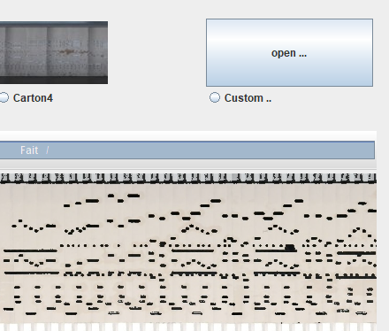

# APrint Studio - 2019 - "Jean Pierre version"

*Patrice Freydiere - Janvier 2019*

## Introduction

APrint 2019, intègre maintenant des fonctionnalités permettant la numérisation de cartons d'orgue.  Ces nouvelles fonctions permettent de pouvoir construire une version numérique d'un carton à partir de prises de vues fixes à intervalles de temps fixes, ou vidéos.

APrint 2019 intègre également de nombreuses améliorations, simplifiant l'utilisation occasionnelle et quotidienne.

## Premiers pas sur la numérisation de cartons

Une nouvelle extension propose deux options :

- reconstruction d'une image de carton à partir d'images

- prise de vues en utilisant une webcam.

La première possibilité, de fusion d'image, permet à partir d'un ensemble d'image, reconstruit une image de carton à partir des différents fragments. 

Une vision interactive permet de régler les différents paramètres, ainsi que de sauvegarder une image unique du carton. Les tranches du cartons sont extraites de l'image d'origine, pour construire une image complète. 

il est alors plus aisé de construite ses propre numérisation et d'obtenir une image complète du carton.

La seconde option permet de numériser directement des cartons à partir d'une webcam 

L'avancement peut être définit :

 - en fonction du temps
 - en utilisant une machine spéciale utilisant GRBL Punch

## Reconnaissance de carton

Pour simplifier les étapes de reconnaissance de carton, l'ergonomie a été améliorée pour simplifier la mise en place de la grille sur le carton, des info bulles permettent la vision des pistes associées.

Le choix du modèle de reconnaissance permet maintenant d'ouvrir la reconnaissance à des modèles spécifiques mis en place par l'utilisateur. Si les choix de modèles proposés en standard ne conviennent pas, cette option permet de réutiliser un modèle de reconnaissance plus adapté au type de support utilisé ou augmenter le taux de reconnaissance.

## Model Editor

De nouvelles améliorations sur le model editor. 

## Perforations de cartons

## Aide en ligne

Et toujours une amélioration sur la partie aide en ligne, permettant de simplifier l'utilisation, et servant de référence sur l'utilisation, compréhension du fonctionnement.

## Et toujours, de petites améliorations

- Le jeu du morceau maintenant se termine de façon moins abrupte
- Bouton "refaire", pour permettre de revenir à l'état après annulation
- Corrections sur la fermetures des fenetres
- Meilleures métriques sur le perçage de cartons
- Prise en charge de commandes électrique pour les machines de perforation. (via GRBL)
