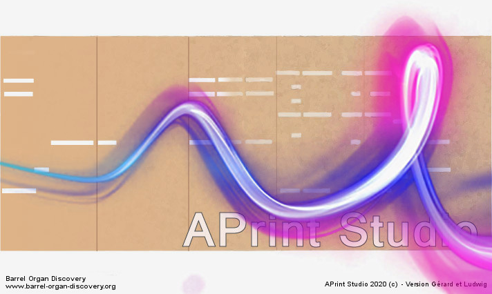

# APrint Studio - 2020 - "Gérard et Ludwig"

*Patrice Freydiere - Novembre 2020*

## Introduction

**APrint 2020**, est une mise à jour technique importante, avec de nouvelles fonctionnalités clefs. 

- Support des **machines à pilotage Lazer**
- Amélioration de l'ergonomie de **l'explorateur de fichier**.
- Support simplifié du **scan par webcam** et **Video**

APrint 2020, supporte désormais les **nouvelles versions de java**, son utilisation depuis les plateformes MacOS, Linux, est donc simplifié.

APrint 2020, porte le nom de **"Gérard et Ludwig"**, qui ont apportés énormément de choses à l'initiative Barrel Organ Discovery, et **ont libéré une partie du code écrit pour la perforation lazer** développé pour eux il y a quelques années. Ce code initial a largement été retravaillé pour simplifier l'ensemble des étapes et rentre cela utilisable pour les spécificités des CNC actuelles (GRBL 1.1 lazer).

L'ensemble de ces nouvelles fonctionnalités sont décrites ci dessous, vous pouvez egalement vous référer aux pages de documentation pour plus d'informations.

## Export CAD et prise en charge perforation Laser

Cette évolution fait partie des ajouts majeurs de cette version, propulsé par les Tests de Yann et Jean Pierre, ceci a pu permettre de simplifier et élargir les possibilités de commandes pour d'autres machines de perforation. Ainsi, APrint supporte avec les même facilité les nouveaux dialects de machine et permet l'intégration par développement de nouveaux types de machine.

### Prise en charge en standard du perçage Laser, avec découpage intégré

Bien que possible depuis quelques années, cette possibilité a été libérée par Gérard. Celle ci a été donc retravaillée, pour intégrer le noyau logiciel d'APrint. Un ensemble de parmètres ont été mis en place, et validés en pratique, pour s'adapter aux différentes productions.

Le middleware GRBL 1.1 a été ciblée pour cette première intégration (très utilisé), il est possible par développement d'en ajouter d'autres. 

Plusieures capacités de parmétrage :

et des méliorations : nouvelle communication machine, nouveau "dialect GCODE", permettant de gérer plus finement le GCODE généré. Et s'adapter en fonction des machines (Krunch, GRBL 1.1).

### Export SVG, DXF

Pour ceux qui disposent d'une machine externe, il est possible d'exporter la découpe d'un carton dans un fichier SVG ou DXF pour perçage externe. Ceci permet de préparer un fichier externe, pour une perforation dans un logiciel de gravage lazer externe.

### Pilotage GRBL - Lazer direct

Plusieures nouvelles machines ont été ajoutées dans l'extension de punch. Initialement concu pour les machines à poiçons, cette extension s'est vu reconstruite pour prendre en charge les découpes linéaires de carton, ceci avec la même interface très simple.

L' utilisation reste aussi simple que la perforation, une fois la machine connectée.

La reprise après panne est également disponible, ainsi que les statistiques.

@@

## Amelioration de la numérisation de cartons

### Nouveau format de fichier bookimage

Cette version 2020 _Q2, apporte un nouveau format de fichier: le fichier bookimage. Ce format de fichier permet de stocker une images visuelle de carton, permettant de faire des **retouches interactives** sur une numérisation. 

Une f

@@@

### Numérisation,à partir de video

## Evolutions sur la simplification d'utilisation

### Vers une utilisation réseau, façilitant le partage et l'échange de fichiers numériques

Pour permettre une collaboration plus directe entre les utilisateurs ou en reseau, et permettre un échange simplifié des création libres, une évolution a été réalisée pour supporter d'autres mode de lecture (notamment reseau).

Ainsi lors de la lecture de fichiers, il est possible de cibler maintenant des sites FTP, HTTP, WEBDav, ... etc. Les utilisateurs ayant plusieurs postes, ou souhaitant partager leur fichiers, ne sont plus forcé d'envoyer les éléments par mail. Ils peuvent utiliser en lecture et écriture un site FTP distant ou HTTP WebDav. L'authentification vers ces connexions réseau est également prise en charge. 

Ceci facilite également la récupération et l'échange de définition d'instruments. En utilisant une URL, le fichier est directement récupéré par APrint et utilisable directement.

Pour les utilisateurs qui ne souhaitent pas partager ou mettre des éléments sur le reseau, ceci ne change rien pour eux.

### Nouvel explorateur de fichier

Une nouvel explorateur de fichier permet de simplifier l'utilisation, et pour aller plus vite dans différents répertoire. 

L'explorateur s'est doté de marque pages, permettant de mémoriser rapidement plusieurs emplacement. un double click sur le marque page positionne l'explorateur au bon endoit. Ceci est particulièrement pratique lorsque l'on navigue à plusieurs emplacements.

### Nouvelle fenetre latérale de description de carton

Les propriétés du carton (métadonnées), sont maintenant accessibles plus facilement avec le panneau latéral. Cette mise en valeur, permet le renseignement des éléments du carton, la génère, les dates associées. Ces informations sont toujours utilisées dans les fonctions d'indexation et de recherche.

La saisie de ces éléments permet d'informer les utilisateurs du carton des éléments de provenance, arrangeur, .. etc

## Model Editor

Le Model editor permet d'automatiser certaines taches de transformation de cartons, et simplifie le passage de fichiers midi ou de transposition. Pour plus d'information sur cet outil, consultez la page de documentation, pour apprendre à l'utiliser et créér vos propres transformations.

Dans cette version des améliorations ont été apportées :

- Sélection visuelles et interactives sur les instruments. Il n'est plus nécessaire désormait de connaitre le nom de l'instrument avec précision, ce choix est réalisé de façon interactive.

## Aide en ligne

Nouvelle présentation de l'aide en ligne. Cette évolution a été proposée pour permettre des traductions automatiques plus simple dans les différentes langues. 

D'autre part, l'aide en ligne est maintenant modifiable par tous. Pour cela il vous suffit d'avoir un compte Github (plateforme hébergeant le code source), de "forker" le repository APrintDoc. Vous pourrez alors par le web, ou sur le poste faire des modifications directement, et proposer des "pull request" pour que celle ci soit intégrées.

L'aide en ligne est automatiquement publiée sur [https://barrelorgandiscovery.github.io/APrintDoc/](https://barrelorgandiscovery.github.io/APrintDoc/) après intégration.

## Compatibilité Java 9+, 11,12,13,14

Un travail sur le logiciel a été réalisé pour prendre en charge les nouvelles versions de java. Cette évolution ne touche pas les utilisateurs Windows, qui ne sont par impactés (la version de java est embarquée dans l'installation, et ne dépends pas du système).

En revanche cela simplifie l'utilisation pour les utilisateurs MacOS (forcés de passer sur les dernnières version).

## Des évolutions techniques

### Passage à la version XML book 2016

Cette nouvelle version de xml, (toujours normalisée), intègre, entre autre l'orientation de déplacement du carton. (droite à gauche ou gauche à droite).

Une réorganisation technique permet maintenant de pouvoir avoir un descriptif XML des commandes de perforation. Ceci pour améliorer les éléments techniques de perforation et permettre la sauvegarde de plan de perforation pour une utilisation en production, prépréparée.

## Et toujours des évolutions de qualité logicielle

- Fix sur la partie sonore, un bug remonté par **Yann Baraffe** a permit d'améliorer l'écoute lorsque l'instrument a beaucoup de registres. Les soundbank SF2 générée dupliquaient les définitions de mapping, provoquant de multiple jeux dans les logiciels. Ceci a été corrigé.

## Breaking Changes - Changements impactants

- Cette version intègre une nouvelle version de la reconnaissance de carton, les modèles de reconnaissance créé avec l'ancienne version ne seront pas compatible avec celle ci. Il sera donc nécessaire de les reconstruire. Pour simplifier, une version associée de Fiji est disponible maintenant dans l'installation d'aprint.