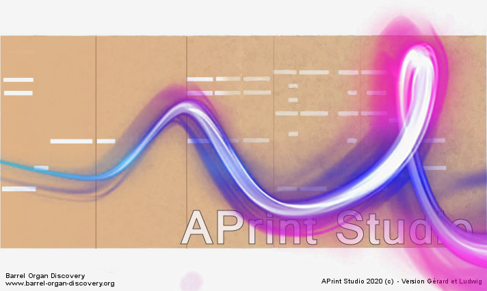
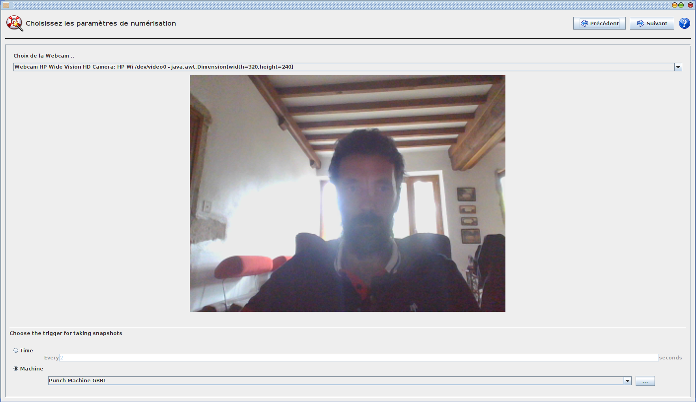
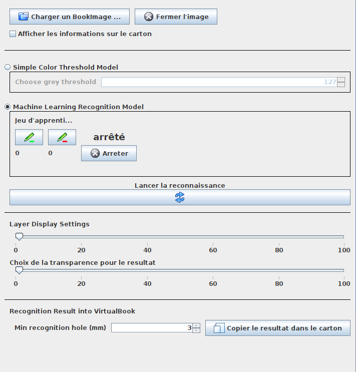
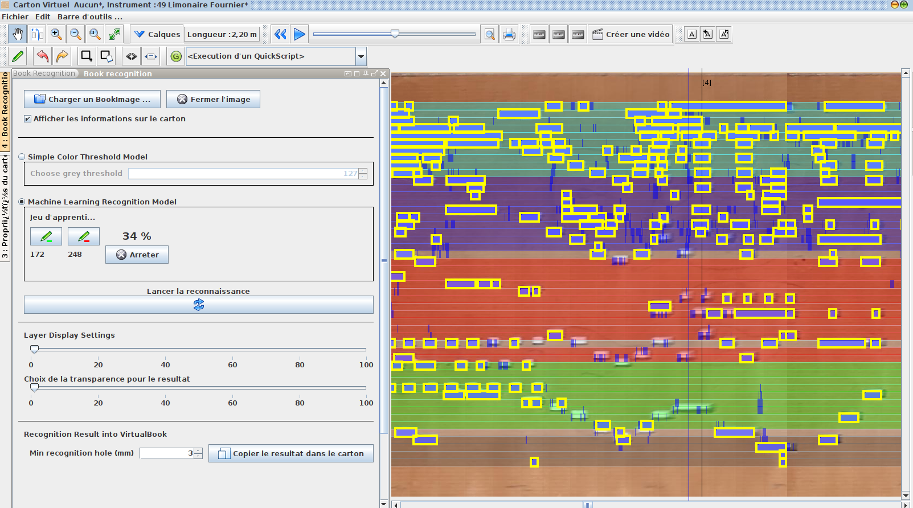
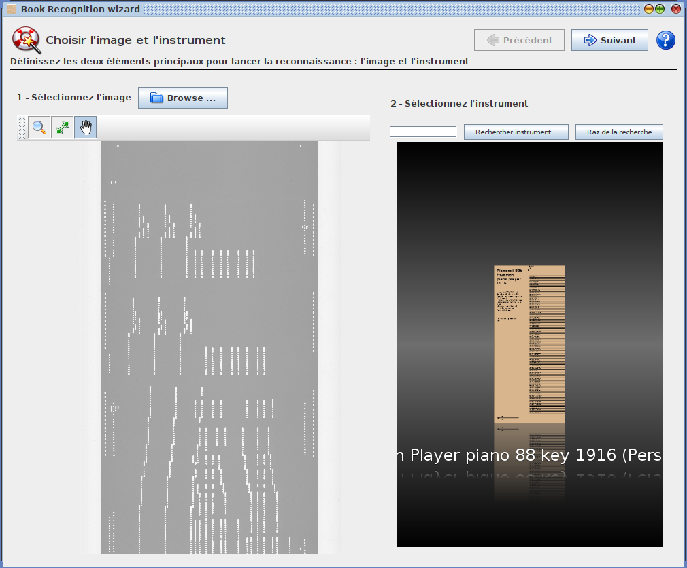
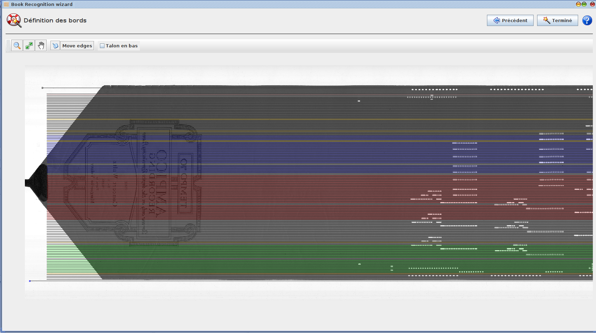
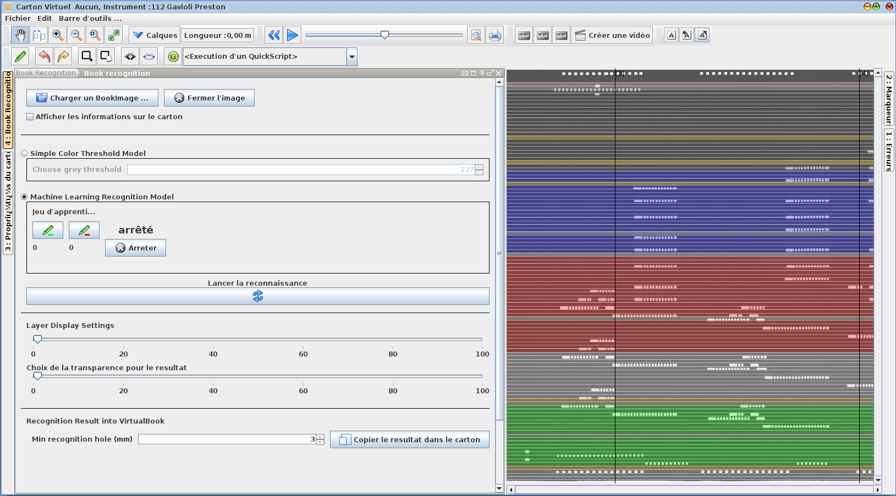
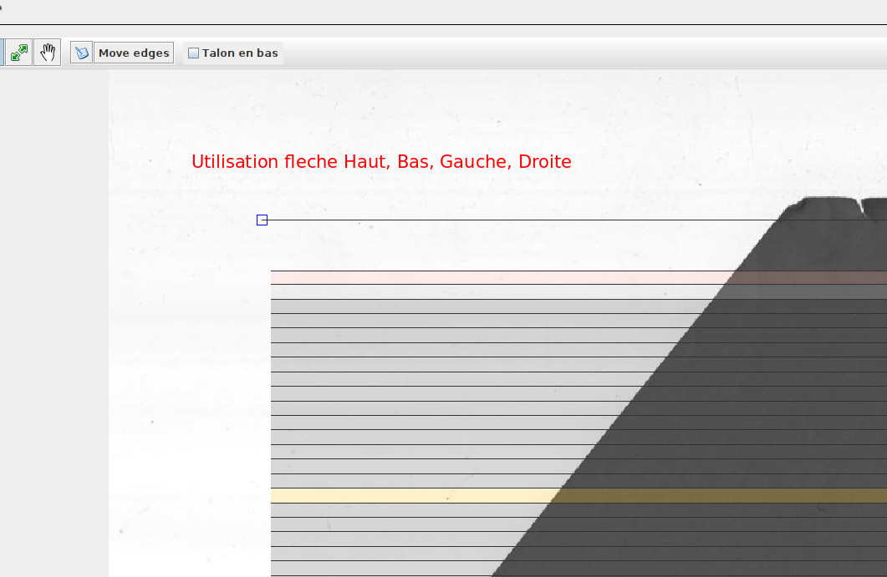

# APrint Studio - Fix - 2020 - "Gérard et Ludwig"

*Patrice Freydiere - Aout 2021*

## Introduction

Après quelques mois d'utilisation, sortie de ce Fix, pour améliorer encore l'utilisation. 

**APrint 2020** Fix , est une mise à jour corrective et d'utilisation proposée, corrigeant quelques problèmes rencontré, sur les points suivants 

L'ensemble des problèmes corrigés peuvent être consultés sur [Les Issues fermé sur Github, ](https://github.com/barrelorgandiscovery/aprintproject/issues?q=is%3Aissue+is%3Aclosed)

### Extension de Scan Machine / Images

Revue des écrans de scan pour propose :

- un feedback sur l'état machine (une console affichage maintenant l'état de la machine), lors de la sélection de l'option de déclenchement utilisant une machine.
- Augmentation de la taille de la combo pour la sélection de la webcam. La taille ne permettait pas de pouvoir voir correctement le nom de la webcam et résolution utilisée (lorsque les noms des webcams sont long)

### Extension de reconnaissance

Amélioration du panneau

Amélioration de l'écran pour avoir les trous en Jaune détouré, ceci permet une meilleure vision de ce qui est récupérer et retravaillé en cours de reconnaissance et travaux unitaires manuels.

Une nouvelle option dans la recconnaissance, par seuillage, permet, dans le cas de numérisation avec couleur, de pouvoir effectuer la reconnaissance directement avec le niveau de gris de l'image (sans apprentissage). Cela accélère significativement la récupération des trous, dans le cas où la numérisation est réalisée avec les moyens normalisés (scanner à plat, ou cis).

Ceci est particulièrement utile pour les rouleaux papier de piano.

Une Nouvelle option d'ouverture de fichier TIFF "large", est également possible actuellement, pour reprendre les numérisation CIS, exportées en TIFF. (demande Reginald, pour wurlitzer & al).

### Reconnaissance de carton video, images

Dans les calages d'images, il est possible maintenant d'utiliser les touches du clavier pour positionner les éléments de calage de façon précise, sans la souris. Cette nouvelle possibilité permet d'être plus précis dans la définition.

### Amélioration Export Midi 0 APrint Studio

La fonction d'export midi, proposait des timings Midi pouvant poser problème sur certains lecture Midi matériels.

### Documentation

de nouvelles rubriques dans la documentation

### Tutoriels

Afin de proposer et montrer comment les fonctionnalités du logiciel peuvent être utilisées, des videos d'apprentissage sont mise en place. Principalement sur Vimeo, puis relayées sur Facebook et YouTube

Liste des tutoriels prévus et réalisés actuellement :

[1 - Les premier pas](https://vimeo.com/577481261)

[2 - Les instruments - introduction](https://vimeo.com/577481261)

[3 - Travailler sur le carton, les outils](https://vimeo.com/577481261)

4 - Utiliser la reconnaissance de cartons

[5 - Introduction au model editor](https://vimeo.com/578856834)

6 - Introduction aux scripts

7 - Les sons dans les instruments

8 - Reconnaissance de disques

9 - Introduction au Bookimage pour la numerisation

10 - Les passerelles de fichiers

11 - Numeriser un carton

