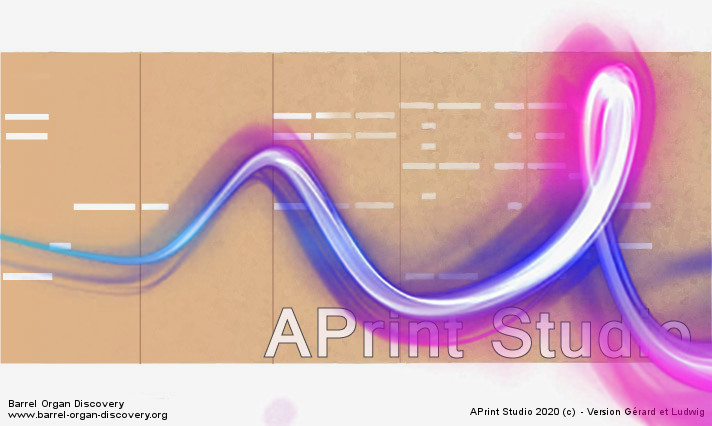

# APrint Studio - Fix - 2022 - "Pierre Louis"

*Patrice Freydiere - Aout 2022*

## Introduction

**APrint 2022**, version corrective, pas de grosse fonctionnalités ajoutées.

L'ensemble des problèmes corrigés peuvent être consultés sur [Les Issues fermé sur Github, ](https://github.com/barrelorgandiscovery/aprintproject/issues?q=is%3Aissue+is%3Aclosed)

NOTA IMPORTANT : Une erreur a été rencontrée par des utilisateurs lors de la sauvegarde des fichiers book. En effet si le book enregistré est plus petit que le fichier d'origine, le fichier ne s'adapte pas à la taille et provoque une erreur à la réécriture. Les personnes concernées ont pu avoir un correctifs proposé. 
Si vous êtes dans ce cas, une procedure simple permet de retrouver ses fichiers book (par modification), la manipulation est assez simple, et permet la récupération du fichier (si non sauvegardée par ailleurs). Les fichiers .bak sont mis en place pour avoir la dernière version avant écrasement.

### Modèle editor

Des enrichissements facilitent l'enregistrement de fichiers midi, ainsi que la transformation en "midiboek", ou façon hollandaise de noter les cartons en midi (cette notation enregistre le carton en détournant les notes midi).

### Extension de reconnaissance

Amélioration du panneau, une nouvelle IHM, avec des onglets et moins de boutons par onglet, permettent de naviguer plus simplement sur les différentes étapes de reconnaissance.

Les outils d'apprentissage, proposent maintenant la possibilité de saisie de rectangle (en complément de la saisie piste). Ce point est particulièrement intéressant lorsque les trous ne font pas la même taille que l'entre piste défini dans la gamme.

### Reconnaissance de carton video, images

Suite à Un problème rencontré,par un utilisateur, lorsque le programme, sous windows a son répertoire de donnée dans un répertoire contient un espace. Ce point pose problème à la librairie de vision utilisée dans APrint. 

Si vous etes dans ce cas, déplacer le répertoire de données dans un répertoire à la racine du disque C, sans espaces. Puis changer le raccourcis pour pointer sur ce répertoire, pour conserver les instruments, scripts et autres configurations personnelles (paramètres de perforation, .. )

### Tutoriels et Video

Peu de retours, ou contribution, cette rubrique n'a pas évoluée

